# Thiết kế MVP hệ thống: lingoRoad

## 1. Thông tin chung

### Tên đề tài

**Xây dựng ứng dụng học tiếng Anh cá nhân hóa với lộ trình học tự động ứng dụng trí tuệ nhân tạo**

### Tên sản phẩm

**lingoRoad** là tên thương hiệu và tên hiển thị chính thức của ứng dụng người học. Logo chuẩn của sản phẩm là [`image.png`](image.png), gồm wordmark trắng, biểu tượng mục tiêu/mũi tên màu cam-đỏ và chữ `D` cách điệu thành con đường.

### Mục tiêu MVP

Xây dựng một phiên bản MVP của ứng dụng học tiếng Anh cá nhân hóa, trong đó người học có thể:

1. Đăng ký / đăng nhập tài khoản.
2. Khai báo mục tiêu học tiếng Anh.
3. Làm bài kiểm tra đầu vào.
4. Nhận kết quả trình độ theo từng kỹ năng.
5. Nhận lộ trình học cá nhân hóa.
6. Học bài và làm bài tập theo lộ trình.
7. Nhận giải thích lỗi sai bằng AI.
8. Theo dõi tiến độ học tập.
9. Được nhắc ôn tập theo cơ chế SRS cơ bản.
10. Admin có thể quản lý câu hỏi, bài học, kỹ năng và xem thống kê.

---

## 2. Phạm vi MVP

### 2.1. Phạm vi nên làm trong MVP

MVP tập trung vào vòng lặp học thích ứng cốt lõi:

```text
Placement Test
→ Xác định trình độ
→ Tạo hồ sơ năng lực người học
→ Sinh lộ trình học
→ Học bài / làm bài tập
→ Cập nhật mastery score
→ Gợi ý bài tiếp theo
```

Các chức năng chính:

| Nhóm chức năng | Mô tả |
|---|---|
| Authentication | Đăng ký, đăng nhập, đăng xuất |
| Onboarding | Người học chọn mục tiêu, thời gian học mỗi ngày |
| Placement Test | Làm bài kiểm tra đầu vào 20 câu |
| CEFR Classification | Phân loại trình độ theo A1, A2, B1, B2 |
| Learner Modeling | Lưu mastery score theo từng kỹ năng |
| Learning Path | Sinh lộ trình học cá nhân hóa |
| Exercise Practice | Làm bài tập theo bài học |
| AI Explanation | Giải thích lỗi sai bằng tiếng Việt |
| SRS Basic | Nhắc ôn tập lại kỹ năng/từ vựng |
| Dashboard | Hiển thị tiến độ, streak, skill mạnh/yếu |
| Admin CMS | Quản lý câu hỏi, bài học, kỹ năng |
| Admin Analytics | Xem thống kê cơ bản |

### 2.2. Phạm vi chưa làm trong MVP

| Chức năng / kỹ thuật | Lý do chưa nên làm |
|---|---|
| DKT / DKVMN / SAINT+ | Cần nhiều dữ liệu tương tác học tập thật |
| DQN / PPO tối ưu lộ trình | Cần môi trường mô phỏng người học đáng tin cậy |
| Whisper fine-tuning | Tốn thời gian, cần dữ liệu audio và GPU |
| MFA phoneme-level alignment | Khó triển khai ổn định trong MVP |
| Pronunciation scoring chuyên sâu | Là một bài toán riêng |
| Automated Writing Evaluation | Chấm writing phức tạp, nên để V2 |
| Fine-tune LLM | Cần dữ liệu, GPU, quy trình đánh giá |
| Leaderboard nâng cao | Cần nhiều user thật mới có ý nghĩa |

---

## 3. Đối tượng sử dụng và phân quyền

### 3.1. Vai trò trong hệ thống

| Vai trò | Mô tả |
|---|---|
| Guest | Người chưa đăng nhập |
| Learner | Người học sử dụng app mobile |
| Admin / Content Manager | Người quản lý nội dung học tập |
| System / AI Service | Thành phần hệ thống xử lý AI, gợi ý, tính điểm |

### 3.2. Bảng phân quyền

| Chức năng | Guest | Learner | Admin / Content Manager | System / AI Service |
|---|---:|---:|---:|---:|
| Xem landing / intro app | Có | Có | Có | Không |
| Đăng ký tài khoản | Có | Không | Không | Không |
| Đăng nhập | Có | Có | Có | Không |
| Cập nhật hồ sơ cá nhân | Không | Có | Có | Không |
| Làm placement test | Không | Có | Không | Không |
| Xem kết quả CEFR | Không | Có | Có thể xem thống kê | Không |
| Xem lộ trình học | Không | Có | Có thể xem thống kê | Không |
| Học bài | Không | Có | Không | Không |
| Làm bài tập | Không | Có | Không | Không |
| Xem giải thích AI | Không | Có | Không | Sinh nội dung |
| Xem dashboard cá nhân | Không | Có | Không | Không |
| Quản lý câu hỏi | Không | Không | Có | Không |
| Quản lý kỹ năng | Không | Không | Có | Không |
| Quản lý bài học | Không | Không | Có | Không |
| Xem thống kê hệ thống | Không | Không | Có | Không |
| Cập nhật mastery score | Không | Không | Không | Có |
| Sinh lộ trình học | Không | Không | Không | Có |
| Lập lịch ôn tập SRS | Không | Không | Không | Có |

### 3.3. Sơ đồ phân quyền tổng quan

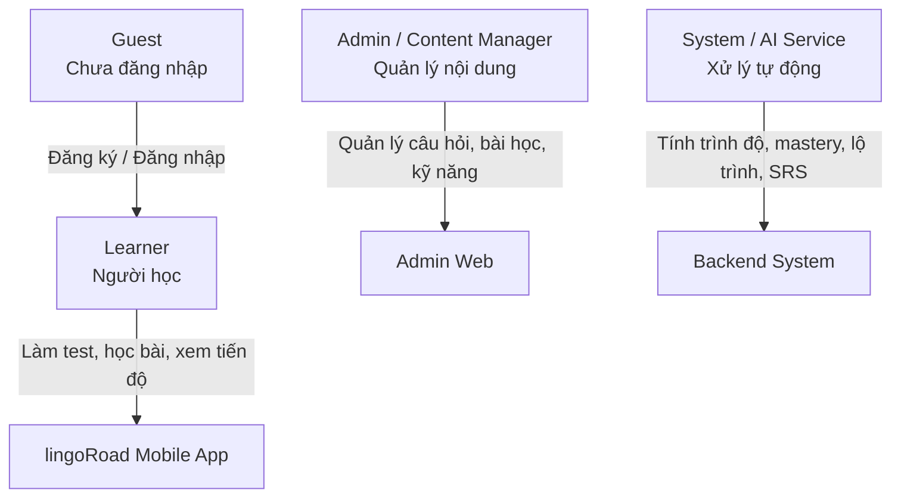

---

# 4. Use Flow tổng thể

## 4.1. Use Flow chính của người học

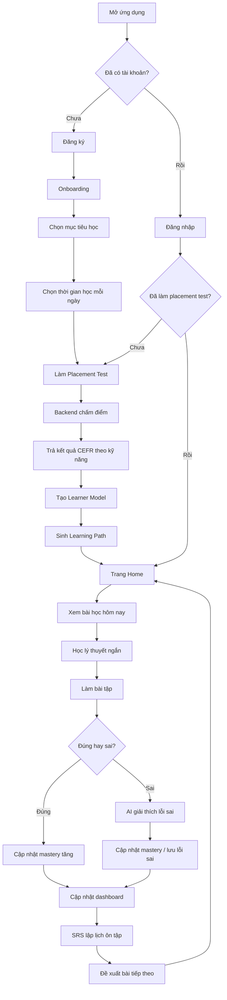

## 4.2. Use Flow Placement Test

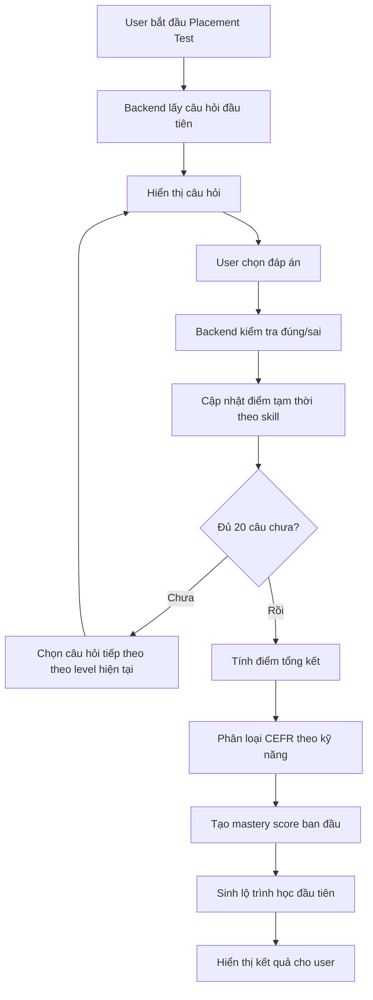

### Logic Placement Test MVP

MVP chưa cần IRT 3PL đầy đủ. Có thể dùng logic đơn giản:

```text
Mỗi câu hỏi có:
- skill
- CEFR level
- difficulty
- correct answer

Nếu trả lời đúng:
  + cộng điểm theo độ khó
  + tăng tạm thời level câu hỏi tiếp theo

Nếu trả lời sai:
  + không cộng điểm hoặc trừ nhẹ
  + giảm hoặc giữ level câu hỏi tiếp theo
```

Ví dụ quy đổi điểm:

| CEFR | Điểm quy đổi |
|---|---:|
| A1 | 1 |
| A2 | 2 |
| B1 | 3 |
| B2 | 4 |
| C1 | 5 |
| C2 | 6 |

MVP nên hỗ trợ trước: **A1, A2, B1, B2**.

---

## 4.3. Use Flow học bài và làm bài tập

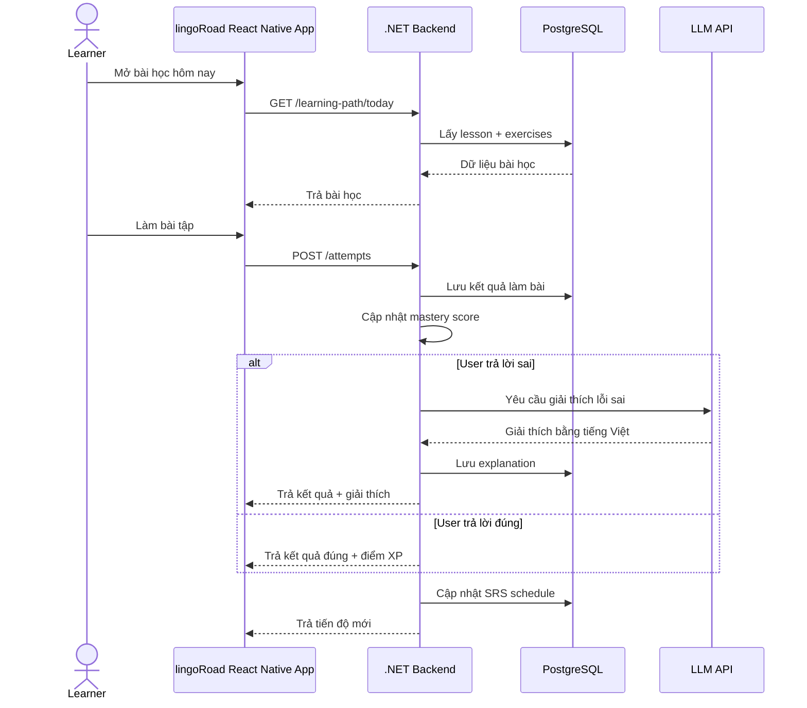

## 4.4. Use Flow Admin quản lý nội dung

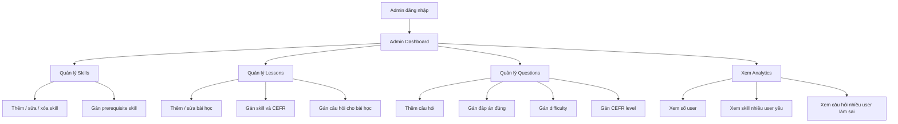

---

# 5. Kiến trúc hệ thống MVP

## 5.1. Kiến trúc tổng quan

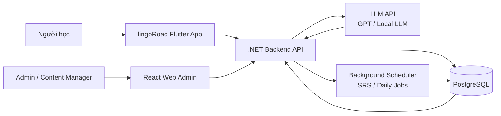

## 5.2. Kiến trúc module backend

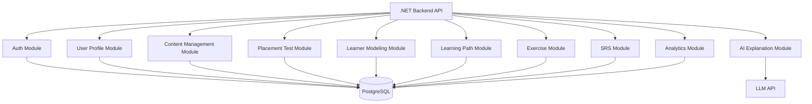

## 5.3. Gợi ý công nghệ

| Thành phần | Công nghệ đề xuất |
|---|---|
| Mobile app | React Native |
| Admin web | Flutter Web |
| Backend | ASP.NET Core Web API |
| Database | PostgreSQL |
| ORM | Entity Framework Core |
| Authentication | JWT |
| AI integration | LLM API hoặc local LLM |
| Background job | Hangfire / Quartz.NET |
| Deployment backend | Docker / VPS / Cloud |
| File storage | Local storage hoặc S3-compatible storage |
| API docs | Swagger / OpenAPI |

---

# 6. Module thiết kế chi tiết

## 6.1. Authentication Module

### Chức năng

- Đăng ký.
- Đăng nhập.
- Đăng xuất.
- Refresh token.
- Phân quyền theo role.

### API gợi ý

```text
POST /api/auth/register
POST /api/auth/login
POST /api/auth/refresh-token
POST /api/auth/logout
GET  /api/auth/me
```

---

## 6.2. User Profile & Onboarding Module

### Chức năng

Người học nhập thông tin ban đầu:

- Tên.
- Mục tiêu CEFR.
- Thời gian học mỗi ngày.
- Mục đích học.
- Kỹ năng muốn cải thiện.

### API gợi ý

```text
GET  /api/users/me
PUT  /api/users/me
POST /api/onboarding
GET  /api/onboarding/status
```

### Data mẫu

```json
{
  "targetCefr": "B1",
  "dailyStudyMinutes": 30,
  "learningPurpose": "communication",
  "focusSkills": ["grammar", "vocabulary", "reading"]
}
```

---

## 6.3. Placement Test Module

### Chức năng

- Tạo bài test đầu vào.
- Chọn câu hỏi theo level.
- Nhận câu trả lời.
- Chấm điểm.
- Phân loại CEFR theo kỹ năng.
- Tạo mastery score ban đầu.

### API gợi ý

```text
POST /api/placement/start
GET  /api/placement/{testId}/next-question
POST /api/placement/{testId}/answer
POST /api/placement/{testId}/submit
GET  /api/placement/{testId}/result
```

### Output kết quả

```json
{
  "overallLevel": "A2",
  "skillLevels": {
    "grammar": "A2",
    "vocabulary": "B1",
    "reading": "A2"
  },
  "weakSkills": [
    "present_perfect",
    "passive_voice",
    "reading_inference"
  ]
}
```

---

## 6.4. Learner Modeling Module

### Chức năng

- Lưu mastery score từng skill.
- Cập nhật mastery sau mỗi lần làm bài.
- Tính skill mạnh/yếu.
- Làm cơ sở sinh lộ trình.

### Logic cập nhật mastery MVP

```text
Nếu trả lời đúng câu dễ:
  mastery += 0.03

Nếu trả lời đúng câu trung bình:
  mastery += 0.05

Nếu trả lời đúng câu khó:
  mastery += 0.08

Nếu trả lời sai câu dễ:
  mastery -= 0.06

Nếu trả lời sai câu trung bình:
  mastery -= 0.04

Nếu trả lời sai câu khó:
  mastery -= 0.02

Giới hạn mastery trong khoảng 0.0 đến 1.0
```

### API gợi ý

```text
GET /api/mastery/me
GET /api/mastery/me/weak-skills
GET /api/mastery/me/skill/{skillId}
```

---

## 6.5. Skill Graph Module

### Skill tree MVP

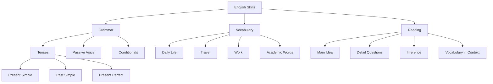

MVP nên có:

```text
30–50 micro-skills
3 nhóm chính:
- Grammar
- Vocabulary
- Reading
```

---

## 6.6. Learning Path Module

### Chức năng

- Sinh lộ trình học theo mục tiêu.
- Chọn skill yếu cần học.
- Sắp xếp theo prerequisite.
- Tạo kế hoạch học theo ngày/tuần.
- Cập nhật lộ trình sau khi user học.

### Logic sinh lộ trình MVP

```text
Input:
- current CEFR level
- target CEFR level
- daily study minutes
- mastery score
- prerequisite graph

Process:
1. Lấy danh sách skill cần đạt để lên target CEFR.
2. Loại các skill user đã thành thạo.
3. Sắp xếp theo prerequisite.
4. Ưu tiên skill có mastery thấp.
5. Chia thành các lesson theo ngày.
6. Chèn review task từ SRS.
```

### Sơ đồ sinh lộ trình

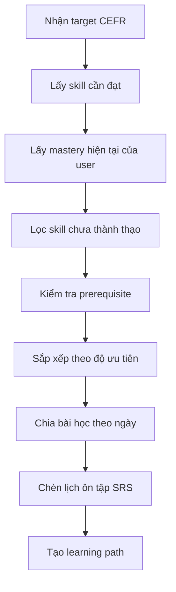

### API gợi ý

```text
POST /api/learning-path/generate
GET  /api/learning-path/me
GET  /api/learning-path/today
POST /api/learning-path/items/{itemId}/complete
POST /api/learning-path/recalculate
```

---

## 6.7. Lesson & Exercise Module

### Dạng bài tập MVP

| Dạng bài | Có nên làm trong MVP? |
|---|---|
| Multiple choice | Có |
| Fill in the blank | Có |
| Error correction | Có |
| Vocabulary matching | Có thể |
| Reading comprehension | Có |
| Speaking | Chưa |
| Writing essay | Chưa |

### API gợi ý

```text
GET  /api/lessons/{lessonId}
GET  /api/lessons/{lessonId}/exercises
POST /api/exercises/{exerciseId}/answer
POST /api/attempts
GET  /api/attempts/me
```

---

## 6.8. AI Explanation Module

### Chức năng

- Giải thích lỗi sai bằng tiếng Việt.
- Giải thích ngữ pháp.
- Gợi ý cách sửa.
- Có thể sinh thêm bài tập tương tự.

### Prompt mẫu

```text
Bạn là gia sư tiếng Anh cho người Việt.

Người học trả lời sai câu sau:
Question: She ___ to London twice.
Options: A. has been, B. have been, C. went, D. has go
User answer: have been
Correct answer: has been
Skill: Present Perfect
CEFR: A2

Hãy giải thích bằng tiếng Việt:
1. Vì sao đáp án của người học sai.
2. Vì sao đáp án đúng là đúng.
3. Nêu mẹo ghi nhớ ngắn gọn.
4. Tạo thêm 1 ví dụ tương tự.
```

### API gợi ý

```text
POST /api/ai/explain-answer
POST /api/ai/generate-exercises
POST /api/ai/explain-grammar
```

---

## 6.9. SRS Module

### Logic SRS MVP

```text
Nếu user sai:
  review sau 1 ngày

Nếu user đúng nhưng response time chậm:
  review sau 3 ngày

Nếu user đúng và response time nhanh:
  review sau 7 ngày

Nếu user ôn lại và tiếp tục đúng:
  tăng interval lên 14 ngày
```

### API gợi ý

```text
GET  /api/srs/due-today
POST /api/srs/{itemId}/review
GET  /api/srs/schedule
```

---

## 6.10. Dashboard & Gamification Module

Dashboard người học hiển thị:

- Overall CEFR.
- Skill progress.
- Weak skills.
- Strong skills.
- Completed lessons.
- XP.
- Streak.
- Due reviews today.

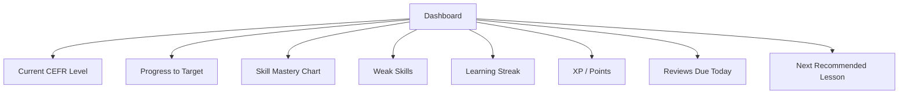

---

# 7. Thiết kế cơ sở dữ liệu MVP

## 7.1. ERD tổng quan

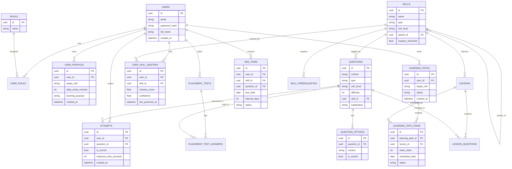

## 7.2. Các bảng tối thiểu cần có

```text
users
roles
user_roles
user_profiles
skills
skill_prerequisites
lessons
questions
question_options
attempts
user_skill_mastery
learning_paths
learning_path_items
srs_items
```

---

# 8. Thiết kế màn hình MVP

## 8.1. Nhận diện lingoRoad

- Hiển thị logo chuẩn trong Splash Screen, luồng xác thực và phần đầu của trang Home.
- Dùng `lingoRoad` đúng camel case trong mọi nhãn hiển thị; không tách thành `Lingo Road` hoặc đổi thành `LingoRoad`.
- Màu nhấn thương hiệu lấy từ logo: cam-đỏ `#F24822`; nền sáng ưu tiên trắng, chữ và icon dùng đen/than để đảm bảo độ tương phản.
- Biểu tượng mục tiêu/mũi tên gợi ý sự tiến bộ có định hướng; biểu tượng đường trong chữ `D` gợi lộ trình học cá nhân hóa. Chỉ dùng các motif này cho trạng thái tiến độ, mục tiêu và learning path, không dùng như trang trí lặp lại.
- Logo trắng phù hợp trên nền tối hoặc màu tương phản; trên nền sáng, dùng phiên bản có vùng nền tối hoặc asset logo tối sau khi được thiết kế. Không tự đổi màu wordmark trong `image.png`.

Chi tiết sử dụng logo, màu sắc và giọng điệu UI được quản lý tại [`docs/product/brand.md`](docs/product/brand.md).

## 8.2. lingoRoad Mobile App - React Native

| Màn hình | Mô tả |
|---|---|
| Splash Screen | Màn hình mở lingoRoad, hiển thị logo chuẩn |
| Login | Đăng nhập lingoRoad |
| Register | Tạo tài khoản lingoRoad |
| Onboarding | Nhập mục tiêu học |
| Placement Intro | Giới thiệu bài test đầu vào |
| Placement Question | Làm câu hỏi placement |
| Placement Result | Xem kết quả CEFR |
| Home | Trang chính |
| Today Plan | Bài học hôm nay |
| Lesson Detail | Nội dung bài học |
| Exercise | Làm bài tập |
| Exercise Result | Kết quả và giải thích |
| AI Explanation | Giải thích lỗi sai |
| Dashboard | Tiến độ học |
| Review | Ôn tập SRS |
| Profile | Hồ sơ cá nhân |

## 8.3. Mobile navigation flow

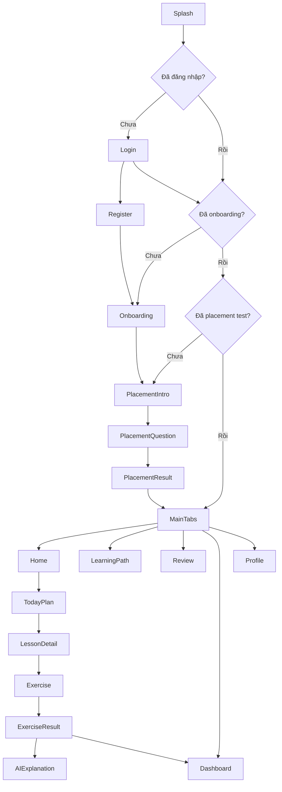

## 8.4. lingoRoad Admin Web - Flutter Web

| Màn hình | Mô tả |
|---|---|
| Admin Login | Đăng nhập admin |
| Admin Dashboard | Tổng quan hệ thống |
| Skill Management | Quản lý kỹ năng |
| Lesson Management | Quản lý bài học |
| Question Management | Quản lý câu hỏi |
| User Analytics | Thống kê người học |
| Question Analytics | Câu hỏi có tỷ lệ sai cao |
| Skill Analytics | Skill nhiều người yếu |

---

# 9. Các thuật toán MVP

## 9.1. Thuật toán phân loại CEFR đơn giản

```text
Input:
- Danh sách câu trả lời placement test
- Mỗi câu có skill, CEFR, difficulty, is_correct

Process:
1. Gom kết quả theo skill.
2. Với mỗi câu đúng, cộng điểm theo difficulty.
3. Tính average score theo từng skill.
4. Map điểm trung bình sang CEFR.
5. Overall CEFR = trung bình có trọng số của các skill.

Output:
- overallLevel
- skillLevels
- weakSkills
```

### Mapping gợi ý

```text
0.0 - 1.4 → A1
1.5 - 2.4 → A2
2.5 - 3.4 → B1
3.5 - 4.4 → B2
4.5 - 5.4 → C1
5.5 - 6.0 → C2
```

MVP chỉ cần A1–B2.

## 9.2. Thuật toán cập nhật mastery score

```text
function updateMastery(current, isCorrect, difficulty, responseTime):
    if isCorrect:
        delta = 0.02 + difficulty * 0.01
        if responseTime < 10:
            delta += 0.01
        if responseTime > 45:
            delta -= 0.01
    else:
        delta = -0.02
        if difficulty <= 2:
            delta -= 0.03

    newMastery = current + delta
    return clamp(newMastery, 0, 1)
```

## 9.3. Thuật toán chọn bài học tiếp theo

```text
Input:
- target CEFR
- mastery scores
- skill graph
- lesson list
- SRS due items

Process:
1. Nếu có item SRS đến hạn, ưu tiên ôn tập.
2. Tìm các skill có mastery thấp hơn threshold.
3. Loại skill chưa đủ prerequisite.
4. Chọn skill có:
   - mastery thấp
   - phù hợp target CEFR
   - có lesson tương ứng
5. Trả về lesson tiếp theo.
```

## 9.4. Thuật toán SRS đơn giản

```text
Input:
- isCorrect
- responseTime
- currentInterval

Process:
Nếu sai:
  interval = 1 ngày

Nếu đúng và chậm:
  interval = 3 ngày

Nếu đúng và nhanh:
  interval = currentInterval * 2

Giới hạn interval tối đa trong MVP: 30 ngày
```

---

# 10. API tổng quan

## 10.1. Auth APIs

```text
POST /api/auth/register
POST /api/auth/login
GET  /api/auth/me
POST /api/auth/logout
```

## 10.2. Learner APIs

```text
GET  /api/users/me
PUT  /api/users/me
POST /api/onboarding
GET  /api/dashboard/me
```

## 10.3. Placement APIs

```text
POST /api/placement/start
GET  /api/placement/{testId}/next-question
POST /api/placement/{testId}/answer
POST /api/placement/{testId}/submit
GET  /api/placement/{testId}/result
```

## 10.4. Learning Path APIs

```text
POST /api/learning-path/generate
GET  /api/learning-path/me
GET  /api/learning-path/today
POST /api/learning-path/items/{itemId}/complete
```

## 10.5. Lesson & Exercise APIs

```text
GET  /api/lessons/{lessonId}
GET  /api/lessons/{lessonId}/exercises
POST /api/exercises/{exerciseId}/answer
POST /api/attempts
GET  /api/attempts/me
```

## 10.6. Mastery APIs

```text
GET /api/mastery/me
GET /api/mastery/me/weak-skills
GET /api/mastery/me/skill/{skillId}
```

## 10.7. SRS APIs

```text
GET  /api/srs/due-today
POST /api/srs/{itemId}/review
GET  /api/srs/schedule
```

## 10.8. AI APIs

```text
POST /api/ai/explain-answer
POST /api/ai/generate-exercises
POST /api/ai/explain-grammar
```

## 10.9. Admin APIs

```text
GET    /api/admin/skills
POST   /api/admin/skills
PUT    /api/admin/skills/{id}
DELETE /api/admin/skills/{id}

GET    /api/admin/lessons
POST   /api/admin/lessons
PUT    /api/admin/lessons/{id}
DELETE /api/admin/lessons/{id}

GET    /api/admin/questions
POST   /api/admin/questions
PUT    /api/admin/questions/{id}
DELETE /api/admin/questions/{id}

GET    /api/admin/analytics/overview
GET    /api/admin/analytics/weak-skills
GET    /api/admin/analytics/question-error-rate
```

---

# 11. Data mẫu cho MVP

## 11.1. Skill mẫu

```json
[
  {
    "id": "present_simple",
    "name": "Present Simple",
    "type": "grammar",
    "cefrLevel": "A1",
    "masteryThreshold": 0.75
  },
  {
    "id": "past_simple",
    "name": "Past Simple",
    "type": "grammar",
    "cefrLevel": "A2",
    "masteryThreshold": 0.75
  },
  {
    "id": "present_perfect",
    "name": "Present Perfect",
    "type": "grammar",
    "cefrLevel": "A2",
    "masteryThreshold": 0.75,
    "prerequisites": ["past_simple"]
  }
]
```

## 11.2. Question mẫu

```json
{
  "id": "q_001",
  "content": "She ___ to London twice.",
  "type": "multiple_choice",
  "cefrLevel": "A2",
  "difficulty": 2,
  "skillId": "present_perfect",
  "options": [
    {
      "id": "a",
      "content": "has been",
      "isCorrect": true
    },
    {
      "id": "b",
      "content": "have been",
      "isCorrect": false
    },
    {
      "id": "c",
      "content": "went",
      "isCorrect": false
    },
    {
      "id": "d",
      "content": "has go",
      "isCorrect": false
    }
  ],
  "explanation": "Với chủ ngữ She trong thì hiện tại hoàn thành, dùng has + V3."
}
```

---

# 12. Chia việc theo team 3 người

## 12.1. Người 1 - React Native

Phụ trách mobile app người học.

| Giai đoạn | Task |
|---|---|
| Tuần 1 | Setup project, navigation, auth UI |
| Tuần 2 | Onboarding, placement test UI |
| Tuần 3 | Placement result, home, today plan |
| Tuần 4 | Lesson detail, exercise screen |
| Tuần 5 | AI explanation screen, review screen |
| Tuần 6 | Dashboard, streak, profile |
| Tuần 7 | API integration, bug fixing |
| Tuần 8 | Demo flow, polish UI |

## 12.2. Người 2 - Flutter

Phụ trách admin web và hỗ trợ nội dung.

| Giai đoạn | Task |
|---|---|
| Tuần 1 | Setup Flutter Web admin |
| Tuần 2 | Admin login, layout dashboard |
| Tuần 3 | Skill management |
| Tuần 4 | Lesson management |
| Tuần 5 | Question management |
| Tuần 6 | Analytics dashboard |
| Tuần 7 | Import dữ liệu mẫu |
| Tuần 8 | Test, polish, demo admin |

## 12.3. Người 3 - Backend .NET

Phụ trách backend, database, logic AI.

| Giai đoạn | Task |
|---|---|
| Tuần 1 | Setup ASP.NET Core, PostgreSQL, auth |
| Tuần 2 | Database schema, seed data |
| Tuần 3 | Placement test APIs |
| Tuần 4 | Mastery score, attempts |
| Tuần 5 | Learning path generation |
| Tuần 6 | SRS, dashboard APIs |
| Tuần 7 | LLM explanation integration |
| Tuần 8 | Admin APIs, deployment, bug fixing |

---

# 13. Roadmap MVP 8 tuần

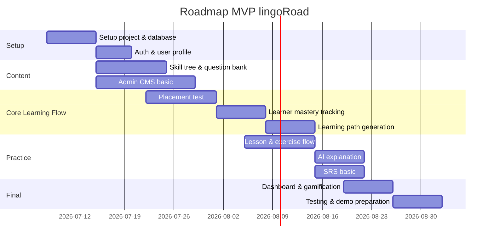

> Ngày trong roadmap có thể điều chỉnh theo lịch thực tế của team.

---

# 14. Kịch bản demo MVP

## 14.1. Demo người học

```text
1. Mở app.
2. Đăng ký tài khoản.
3. Chọn mục tiêu: đạt B1 trong 8 tuần.
4. Chọn thời gian học: 30 phút/ngày.
5. Làm placement test 20 câu.
6. Xem kết quả:
   - Grammar: A2
   - Vocabulary: B1
   - Reading: A2
   - Overall: A2+
7. App sinh lộ trình học tuần đầu.
8. Vào bài "Present Perfect Basics".
9. Làm sai câu hỏi.
10. App giải thích lỗi sai bằng AI tiếng Việt.
11. Dashboard cập nhật mastery score.
12. App đưa kỹ năng đó vào lịch ôn tập SRS.
```

## 14.2. Demo admin

```text
1. Admin đăng nhập.
2. Tạo một skill mới.
3. Tạo một bài học mới.
4. Tạo câu hỏi mới.
5. Gán câu hỏi vào bài học.
6. Xem thống kê skill nhiều người yếu.
7. Xem câu hỏi có tỷ lệ sai cao.
```

---

# 15. Tiêu chí hoàn thành MVP

## 15.1. Tiêu chí chức năng

| Tiêu chí | Hoàn thành khi |
|---|---|
| Auth | User có thể đăng ký / đăng nhập |
| Onboarding | User có thể nhập mục tiêu học |
| Placement Test | User làm được test 20 câu |
| CEFR Result | App trả kết quả level theo skill |
| Learning Path | App sinh được lộ trình học |
| Lesson | User xem được bài học |
| Exercise | User làm được bài tập |
| Mastery | Hệ thống cập nhật mastery score |
| AI Explanation | App giải thích lỗi sai bằng tiếng Việt |
| SRS | App có danh sách bài cần ôn |
| Dashboard | User xem được tiến độ |
| Admin CMS | Admin quản lý được skill, lesson, question |

## 15.2. Tiêu chí dữ liệu MVP

| Loại dữ liệu | Số lượng tối thiểu |
|---|---:|
| Skills | 30 |
| Lessons | 20 |
| Questions | 100 |
| CEFR levels | A1, A2, B1, B2 |
| Exercise types | 3 |
| Admin users | 1 |
| Test learner accounts | 5–10 |

## 15.3. Tiêu chí kỹ thuật

| Tiêu chí | Yêu cầu |
|---|---|
| API | Có Swagger/OpenAPI |
| Database | Có migration và seed data |
| Auth | JWT-based |
| Mobile | Chạy được trên Android emulator/device |
| Admin | Chạy được trên web browser |
| AI | Có ít nhất 1 API giải thích lỗi sai |
| Deployment | Backend và database có thể chạy bằng Docker hoặc server |
| Logging | Có log lỗi cơ bản |
| Validation | Validate input ở backend |

---

# 16. Rủi ro và hướng xử lý

| Rủi ro | Ảnh hưởng | Cách xử lý |
|---|---|---|
| Scope quá rộng | Không hoàn thành MVP | Chỉ làm core flow, bỏ AI nặng |
| Thiếu dữ liệu câu hỏi | App không có nội dung học | Tạo 100–200 câu hỏi mẫu thủ công + import CSV |
| LLM API tốn phí | Không ổn định demo | Có fallback explanation mẫu trong database |
| React Native và Flutter lệch UI | Mất thời gian đồng bộ | React Native làm app, Flutter chỉ làm admin |
| Backend quá tải task | Chậm API integration | Ưu tiên API core trước, analytics sau |
| Placement Test chưa chuẩn | Kết quả chưa chính xác | Ghi rõ là heuristic MVP, không phải test chuẩn Cambridge |
| Learning path chưa tối ưu | Gợi ý còn đơn giản | Dùng prerequisite + weak skill là đủ cho MVP |
| SRS chưa chính xác | Ôn tập chưa tối ưu | Dùng rule đơn giản, để FSRS cho V2 |

---

# 17. Sơ đồ vòng lặp học thích ứng của MVP

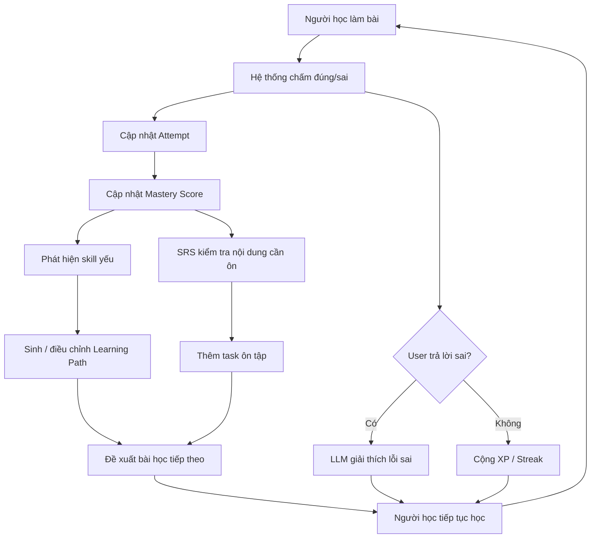

---

# 18. MVP một câu

Phiên bản MVP cần chứng minh được rằng:

> Ứng dụng có thể kiểm tra trình độ ban đầu của người học, tạo hồ sơ năng lực, sinh lộ trình học cá nhân hóa, cho người học làm bài tập, cập nhật điểm thành thạo và dùng AI để giải thích lỗi sai bằng tiếng Việt.

---

# 19. Đề xuất tên module trong source code

## Backend .NET

```text
Auth
Users
Profiles
Skills
Lessons
Questions
PlacementTests
Attempts
Mastery
LearningPaths
Srs
AiTutor
Admin
Analytics
```

## Mobile React Native

```text
auth
onboarding
placement
home
learningPath
lesson
exercise
review
dashboard
profile
shared
```

## Flutter Web Admin

```text
auth
dashboard
skills
lessons
questions
analytics
shared
```

---

# 20. Tổng kết hướng triển khai

Với team 3 người:

```text
React Native developer
→ Làm app mobile cho người học.

Flutter developer
→ Làm Flutter Web Admin để quản lý nội dung.

Backend .NET developer
→ Làm API, database, logic placement, mastery, learning path, SRS, AI explanation.
```

MVP không cần chứng minh toàn bộ AI nâng cao. MVP chỉ cần làm tốt:

```text
Placement Test
→ Learner Modeling
→ Learning Path
→ Exercise
→ AI Feedback
→ Dashboard
```

Đây là phạm vi phù hợp, có thể demo rõ ràng và bám sát đề tài thực tập.
