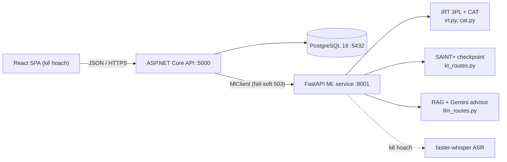

# Báo cáo Mảng 3 — Tối ưu hóa lộ trình học & Kiến trúc hệ thống LingoRoad

> Bản tiếng Việt tổng hợp từ `docs/learning-path-optimization.md` và `docs/system-architecture.md` (cập nhật 17/07/2026, đã bao gồm số liệu đo được của task 15). Các đường dẫn tệp tính từ gốc repo.

---

# PHẦN A — BÀI TOÁN TỐI ƯU HÓA LỘ TRÌNH HỌC

## A.1. Mô tả bài toán (chưa hình thức hóa)

Chương trình học của LingoRoad gồm **156 kỹ năng vi mô** (micro-skills) được tổ chức thành một **đồ thị có hướng không chu trình (DAG)** biểu diễn quan hệ tiên quyết: nút = kỹ năng gắn với một cấp độ CEFR, cạnh = "phải học trước". Mỗi người học có một **vector độ thành thạo** (mastery) — một số trong [0, 1] cho từng kỹ năng (bảng `Masteries`) — và một cấp độ CEFR mục tiêu. **Lộ trình học** (learning path) là chuỗi hoạt động học mà hệ thống gợi ý. Yêu cầu đặt ra: sinh lộ trình **tối thiểu hóa thời gian đạt mục tiêu**.

Bốn yếu tố khiến bài toán khó hơn việc "sắp xếp danh sách kỹ năng":

1. **Thứ tự tiên quyết** — kỹ năng tiên quyết phải học trước; đây là ràng buộc cứng, không phải ưu tiên mềm.
2. **Lợi ích phụ thuộc thứ tự** — học một kỹ năng khi kỹ năng tiên quyết còn yếu gần như là công sức lãng phí, nên giá trị của một hành động phụ thuộc vào những gì đã học trước đó.
3. **Sự quên** — độ thành thạo suy giảm theo thời gian (`src/backend/LingoRoad/Domain/MasteryCalc.cs` suy giảm về 0.5 với tốc độ 0.03/ngày), nên một thứ tự "một chiều" là chưa đủ; lộ trình tốt phải có ôn tập.
4. **Tính ngẫu nhiên** — lợi ích học tập thực tế thay đổi theo từng người học và từng lần luyện.

Cơ sở trong repo: bộ sinh lộ trình production dựa trên luật (`src/backend/LingoRoad/Domain/PathBuilder.cs`); động lực học độ thành thạo định nghĩa mô hình chuyển trạng thái nằm trong `MasteryCalc.cs`; bản chứng minh khái niệm (PoC) học tăng cường là task 15 (`src/backend/.claude/tasks/task-15-dqn-poc.md`).

## A.2. Phát biểu bài toán hình thức (đầu vào / đầu ra / ràng buộc)

### A.2.1. Dạng tổ hợp tĩnh (bài toán tối ưu tổ hợp)

**Đầu vào:**
- Đồ thị kỹ năng G = (S, E): |S| = 174 nút — 156 lá học được + 18 nút chứa (container); cạnh (p, s) ∈ E nghĩa là p là tiên quyết của s (bảng `SkillEdges`).
- Cấp độ CEFR ℓ(s) ∈ {A1 … C2} và chi phí học kỳ vọng c(s) > 0 (phút) cho mỗi kỹ năng.
- Độ thành thạo hiện tại m ∈ [0, 1]^S; ngưỡng thành thạo τ = 0.8; tập đã thành thạo D = {s : m_s ≥ τ}.
- Cấp độ mục tiêu g. Tập đích T = {s ∈ S : s là lá, ℓ(s) ≤ g} \ D.

**Đầu ra:** một thứ tự π = (s₁, …, s_k) của T — chính là lộ trình học.

**Hàm mục tiêu:** tối thiểu hóa tổng thời gian học Σᵢ c(sᵢ), cộng chi phí ôn tập khi mô hình hóa sự quên.

**Ràng buộc:**
- **C1 — Thứ tự tiên quyết (cứng):** với mọi (p, sᵢ) ∈ E mà p ∉ D, p phải đứng trước sᵢ trong π. (Giả định các tiên quyết của kỹ năng đích cũng là kỹ năng đích học được — lá với ℓ(p) ≤ g. Đây là một lý tưởng hóa mô hình: đồ thị seed thỏa mãn 140/144 cạnh tiên quyết; 4 ngoại lệ — 3 cạnh phân cấp lấy container làm tiên quyết và 1 tiên quyết B2 của một kỹ năng B1 — bị các bộ lọc production loại bỏ.)
- **C2 — Lọc theo mục tiêu:** mọi sᵢ đều có ℓ(sᵢ) ≤ g.
- **C3 — Chỉ nút lá:** kỹ năng container (nút cha) không học được trực tiếp.
- **C4 — Ngân sách phiên học:** lộ trình được tiêu thụ theo từng tiền tố tối đa B phút mỗi phiên.

**Độ khó.** Nếu lợi ích học là tất định và không phụ thuộc thứ tự thì mọi thứ tự tô-pô có chi phí bằng nhau và bài toán giải được trong O(V+E) — đây là lý do greedy production hoạt động được. Bài toán trở nên thật sự khó đúng khi thứ tự ảnh hưởng chi phí: bài toán xếp lịch một máy với ràng buộc thứ tự trước–sau (1|prec|Σ wⱼCⱼ) là **NP-khó mạnh** (Lawler 1978; Lenstra & Rinnooy Kan 1978). Sự quên và lợi ích ngẫu nhiên đẩy bài toán thực tế ra khỏi khung tĩnh hoàn toàn — dẫn đến:

### A.2.2. Dạng ngẫu nhiên — Quá trình quyết định Markov (MDP)

Đây là dạng phát biểu chuẩn tắc, và cũng là dạng task 15 hiện thực ở quy mô thu nhỏ:

- **Trạng thái** s_t = m_t ∈ [0, 1]^n — vector độ thành thạo (có thể mở rộng thêm đặc trưng thời gian).
- **Hành động** A(s_t) — các kỹ năng học được (lá, ℓ ≤ g), có thể che chắn (mask) chỉ còn kỹ năng đã đủ tiên quyết.
- **Chuyển trạng thái:** học kỹ năng a làm m_a tăng một lượng lợi ích học — kỳ vọng α·(1 − m_a) khi đủ tiên quyết, một lượng lãng phí nhỏ ε khi chưa đủ (giá trị toy: α = 0.15, ε = 0.01) — đồng thời **tất cả** kỹ năng suy giảm do quên (toy: −0.005 mỗi bước; production: suy giảm mũ về 0.5 với tốc độ 0.03/ngày theo `MasteryCalc.cs`).
- **Phần thưởng** r_t = mean(m_{t+1}) − mean(m_t), cộng thưởng kết thúc (+1) khi mọi kỹ năng đích đạt τ. (Mục tiêu "tối thiểu thời gian" thuần túy sẽ dùng r = −1 mỗi bước; dạng phần thưởng theo mức tăng thành thạo là một proxy được định hình dày hơn cho cùng mục tiêu.)
- **Hàm mục tiêu:** chính sách π tối đa hóa E[Σ_t γᵗ r_t], hệ số chiết khấu γ = 0.98.
- **Phương trình tối ưu Bellman:** Q*(s, a) = E[r + γ·max_{a'} Q*(s', a')], và V*(s) = max_a Q*(s, a).

Dạng tĩnh ở A.2.1 là trường hợp đặc biệt: lợi ích tất định, không quên, chi phí mỗi kỹ năng cố định.

## A.3. Phương pháp 1 — Thuật toán tham lam (Greedy)

Có hai biến thể greedy đáng quan tâm:

**A.3.1. Pipeline luật (production, đã hiện thực).** `PathBuilder.cs`: sắp xếp tô-pô Kahn trên DAG với phá hòa tất định (CEFR rồi đến mã kỹ năng), sau đó lọc — bỏ container (C3), bỏ trên mục tiêu (C2), bỏ đã thành thạo — chú giải, cắt ngắn. Độ phức tạp O(V+E). "Tham lam" theo nghĩa cam kết một thứ tự ưu tiên cố định, không nhìn trước (zero lookahead).

**A.3.2. Greedy theo điểm số.** Lặp lại việc chọn kỹ năng đã mở khóa có giá trị tức thời trên đơn vị chi phí tốt nhất: score(a) = α·(1 − m_a) / c(a). O(n log n) với heap. Lưu ý đây là chính sách khác với baseline thứ tự cố định ở A.7: nó chuyển sang kỹ năng mới ngay khi mở khóa (tiên quyết ≥ 0.5), chứ không đợi học xong kỹ năng hiện tại (≥ τ).

**Tính chất:**
- (+) Tức thời; không cần huấn luyện; không cần dữ liệu — chạy được ngay ngày đầu, không cần lịch sử người học.
- (+) Ràng buộc được đảm bảo **theo cấu trúc** (C1–C3 là bộ lọc, không phải phạt).
- (+) Giải thích được hoàn toàn: "Past Simple đứng trước Present Perfect vì nó là tiên quyết."
- (−) Thiển cận: bỏ qua *giá trị mở khóa* (một tiên quyết lợi ích thấp có thể mở khóa các kỹ năng phụ thuộc giá trị cao) và không căn được thời điểm ôn tập theo sự quên.
- (−) Không có bảo đảm tối ưu khi thứ tự ảnh hưởng chi phí (độ khó ở A.2.1).

## A.4. Phương pháp 2 — Quy hoạch động (Dynamic Programming)

DP giải MDP **chính xác** bằng quy nạp lùi trên phương trình Bellman.

**Lặp giá trị (value iteration):** V_{k+1}(s) = max_a E[r(s, a) + γ·V_k(s')]. Phép cập nhật là một ánh xạ co hệ số γ, nên hội tụ về V* từ mọi điểm xuất phát. Chi phí mỗi lượt quét: O(|Trạng thái| · |Hành động| · |Trạng thái kế|).

**Lời nguyền số chiều.** Độ thành thạo liên tục, nên phải rời rạc hóa mỗi kỹ năng trong n kỹ năng thành k mức → kⁿ trạng thái:
- n = 5, k = 11 → 11⁵ = 161.051 trạng thái — dễ dàng xử lý (môi trường toy của task 15).
- n = 156, k = 11 → 11¹⁵⁶ ≈ 10¹⁶² trạng thái — nhiều hơn số nguyên tử trong vũ trụ quan sát được (~10⁸⁰). DP không bao giờ chạy được ở quy mô production.

**Các trường hợp đặc biệt xử lý được:**
- Không quên + thành thạo nhị phân: trạng thái thu gọn thành *tập con* kỹ năng đã thành thạo → 2ⁿ trạng thái, DP tập con kiểu Held–Karp — dùng được đến n ≈ 20.
- Môi trường toy (n = 5): value iteration trên lưới k = 11 rẻ và cho nghiệm tối ưu chính xác của mô hình **đã rời rạc hóa** — mốc tham chiếu gần tối ưu để đo greedy và DQN (A.7).

DP còn đòi hỏi mô hình chuyển trạng thái ở dạng đóng. Với người học thực, ta chỉ có *mẫu* của các lần chuyển — đúng bối cảnh mà RL được sinh ra để xử lý.

## A.5. Phương pháp 3 — Học tăng cường (DQN / PPO)

RL học chính sách từ tương tác được lấy mẫu, thoát lời nguyền số chiều nhờ xấp xỉ hàm (mạng nơ-ron tổng quát hóa qua các trạng thái mà DP phải liệt kê).

**A.5.1. DQN** (Mnih và cộng sự, 2015) — thứ task 15 xây dựng. Xấp xỉ Q*(s, ·) bằng MLP (toy: 5 → 64 → 64 → 5); khám phá ε-greedy (1.0 → 0.05); bộ nhớ phát lại kinh nghiệm (experience replay, buffer 10k) để khử tương quan mẫu; mạng mục tiêu (target network) đồng bộ mỗi 200 bước để ổn định mục tiêu bootstrap r + γ·max Q_target(s'); mất mát smooth-L1, Adam 1e-3. Thuộc nhóm value-based và off-policy (phát lại kinh nghiệm cũ), phù hợp với không gian hành động rời rạc nhỏ.

**A.5.2. PPO** (Schulman và cộng sự, 2017). Phương pháp policy-gradient tối ưu hàm mục tiêu thay thế có cắt (clipped surrogate) L = E[min(ρ_t·Â_t, clip(ρ_t, 1−ε, 1+ε)·Â_t)], trong đó ρ_t là tỉ số xác suất chính sách mới/cũ và Â_t là ước lượng lợi thế (advantage) — phép cắt giới hạn mức dịch chuyển chính sách mỗi lần cập nhật, cho huấn luyện ổn định. On-policy nên cần nhiều mẫu hơn DQN, nhưng được ưa chuộng ở quy mô lớn: 156 hành động thay vì 5, chính sách ngẫu nhiên tự nhiên (hữu ích khi nhiều kỹ năng tốt ngang nhau), và độ bền với siêu tham số. PPO là ứng viên tự nhiên cho quy mô production; DQN là công cụ đúng cho PoC 5 kỹ năng.

**A.5.3. Ràng buộc cứng.** C1–C3 không biểu diễn tự nhiên được bằng phần thưởng. Cách chuẩn là **action masking**: hành động không hợp lệ nhận Q = −∞ (DQN) hoặc xác suất 0 (PPO) trước khi chọn. Phạt bằng phần thưởng chỉ là ràng buộc mềm — chính sách sau huấn luyện vẫn có thể thỉnh thoảng vi phạm, điều không chấp nhận được với yêu cầu "không bao giờ gợi ý kỹ năng trước tiên quyết của nó". (Môi trường toy thay vào đó làm cho vi phạm chỉ là lãng phí — lợi ích ε — để agent có thể *tự khám phá* thứ tự; production bắt buộc phải mask.)

**A.5.4. Vấn đề mô phỏng.** RL cần một môi trường để luyện, mà người học thực thì quá chậm và quá quý để khám phá trên họ. Do đó ta huấn luyện trong bộ mô phỏng — động lực học toy bây giờ, mô hình người học khớp từ EdNet sau này theo yêu cầu — và thừa hưởng **khoảng cách mô phỏng–thực tế (sim-to-real gap)**: chính sách chỉ tốt bằng độ trung thực của bộ mô phỏng. Đây là lý do sâu xa nhất khiến production giữ lộ trình greedy trong khi RL vẫn là chứng minh khái niệm.

## A.6. So sánh ba phương pháp

"**Độ chính xác**" = mức độ gần nghiệm tối ưu thực của bài toán được mô hình hóa. "**Chi phí tính toán**" tách thành chi phí **ngoại tuyến** (giải/huấn luyện, một lần) và **trực tuyến** (mỗi yêu cầu).

| Tiêu chí | Greedy (luật) | Quy hoạch động | RL (DQN/PPO) |
|---|---|---|---|
| Chất lượng nghiệm | Không bảo đảm; gần tối ưu khi lợi ích ~độc lập | **Tối ưu chính xác** của MDP được mô hình hóa | Tiến gần tối ưu khi đủ huấn luyện; không bảo đảm |
| Chi phí trực tuyến | O(V+E), dưới mili-giây | Tra bảng O(1) — *nếu* bảng tồn tại | Một lượt forward mạng nơ-ron, ~ms |
| Chi phí ngoại tuyến | Không có | O(kⁿ·\|A\|) mỗi lượt quét — chỉ ở quy mô toy | Huấn luyện trên mô phỏng (phút với toy; giờ+ ở quy mô lớn) |
| Nhu cầu dữ liệu | Không | Mô hình chuyển trạng thái dạng đóng | Bộ mô phỏng, hoặc log tương tác khổng lồ |
| Ràng buộc cứng (C1–C3) | Theo cấu trúc | Theo thiết kế không gian trạng thái | Cần action masking |
| Khả năng giải thích | Hoàn toàn | Hoàn toàn (trong phạm vi mô hình) | Thấp — Q-value khó diễn giải |
| Mở rộng tới 156 kỹ năng | Có | **Không** (11¹⁵⁶ trạng thái) | Có (xấp xỉ hàm) |
| Trạng thái trong LingoRoad | **Production** (`PathBuilder.cs`) | Baseline toy (A.7) | PoC đã chạy (task 15) |

Kết luận: greedy là phương pháp duy nhất có chi phí bằng không, không cần dữ liệu, và giải thích được hoàn toàn — đồng thời đủ-tối-ưu khi lợi ích gần độc lập. DP là phương pháp duy nhất có bảo đảm, nhưng chỉ tồn tại ở quy mô toy, nơi vai trò của nó là *đo lường hai phương pháp còn lại*. RL là phương pháp duy nhất vừa mở rộng được vừa tối ưu các hiệu ứng dài hạn (giá trị mở khóa, sự quên), đổi lại cần bộ mô phỏng, chi phí huấn luyện, và tính khó diễn giải.

### A.6.1. Số liệu đo được trên ToyLearnerEnv (task 15)

| Chính sách | Return trung bình | Độ dài episode TB | Tỉ lệ đạt mục tiêu | Chi phí ngoại tuyến (s) | Độ trễ (ms/quyết định) |
|---|---|---|---|---|---|
| DP (value iteration) | 0.636 | 60.0 | 0.00 | 50.2 | 0.149 |
| DQN | 0.581 | 60.0 | 0.00 | 82.3 | 0.071 |
| Greedy (thứ tự cố định) | 0.533 | 60.0 | 0.00 | 0.0 | 0.002 |
| Ngẫu nhiên | 0.197 | 60.0 | 0.00 | 0.0 | 0.002 |

100 episode đánh giá, seed 123, động lực học giống hệt nhau cho mọi chính sách (giao thức A.7). Thứ tự kỳ vọng **DP ≥ DQN ≥ greedy > ngẫu nhiên** được xác nhận. Hai phát hiện đo được đáng trích dẫn:

1. **Mục tiêu không bao giờ đạt được ở n = 5.** Tổng suy giảm do quên là 5 × 0.005 = 0.025/bước trong khi lợi ích luyện tập co lại khi độ thành thạo tăng (0.15·(1−m)), nên đẩy cả năm kỹ năng lên ≥ 0.8 *đồng thời* cần ~80–90 bước — vượt trần 60 bước, với *mọi* chính sách (tỉ lệ đạt mục tiêu 0.00 toàn bảng). Phép so sánh do đó được quyết định thuần túy bởi hiệu suất tăng trưởng độ thành thạo.
2. **Greedy thứ tự cố định không còn gần tối ưu khi có sự quên:** DQN vượt nó +9% và DP vượt +19% return trung bình, vì thứ tự cố định cứ luyện lại các kỹ năng đầu với lợi ích cận biên giảm dần thay vì tối đa hóa lợi ích cận biên. Các khoảng cách này chính là cột "độ chính xác" ở bảng trên, được đo bằng số.

Báo cáo đầy đủ kèm đường cong học: `src/backend/ml/reports/dqn_poc.md`.

## A.7. Giao thức thí nghiệm (đã thực hiện cùng task 15)

Mục đích: đặt số liệu đo được phía sau A.6 — cả bốn chính sách trên **cùng một động lực học**. Đã thực hiện ngày 17/07/2026; kết quả ở A.6.1 và `src/backend/ml/reports/dqn_poc.md`; mã nguồn tại `src/backend/ml/lingoroad_ml/rl/`. Hai chi tiết giao thức đã thay đổi trong lúc hiện thực — đều được ghi chú bên dưới.

**Môi trường.** `ToyLearnerEnv` của task 15: n = 5 kỹ năng nối chuỗi (kỹ năng *i* cần kỹ năng *i−1* ≥ 0.5), lợi ích 0.15·(1−m) khi đã mở khóa, ngược lại 0.01; suy giảm 0.005/bước cho mọi kỹ năng; episode kết thúc khi tất cả ≥ 0.8 (thưởng +1) hoặc sau 60 bước. Lưu ý các phép chuyển là tất định — chỉ `reset()` là ngẫu nhiên — nên nghiệm DP chính xác được định nghĩa rõ.

**Các chính sách:**
1. **Ngẫu nhiên** — đều trên 5 hành động.
2. **Greedy** — kỹ năng đầu tiên có độ thành thạo < 0.8, từ trước ra sau (chính sách thứ tự cố định của task 15; bản thu nhỏ của pipeline luật ở A.3.1: một thứ tự ưu tiên cố định, bỏ qua kỹ năng đã thành thạo).
3. **DP** — value iteration trên môi trường rời rạc hóa: k = 11 mức mỗi kỹ năng (0.0, 0.1, …, 1.0) → 11⁵ = 161.051 trạng thái; phép chuyển lấy từ động lực học thật; γ = 0.98; lặp đến khi ‖V_{k+1} − V_k‖∞ < 1e-6.
   *Điều chỉnh trong lúc hiện thực:* phép làm tròn về nút lưới gần nhất như đặc tả ban đầu bị **suy biến** ở k = 11 — lợi ích luyện tập ở vùng thành thạo cao nhỏ hơn nửa ô lưới (0.7 → 0.74 lại tròn về 0.7), khiến mục tiêu không thể đạt trong chuỗi đã làm tròn và phần thưởng +1 biến mất khỏi mọi phép chuyển dạng bảng; DP đo được khi đó *thấp hơn* greedy. Bản hiện thực thay vào đó biểu diễn trạng thái kế bằng **nội suy đa tuyến** trên 2⁵ nút lưới lân cận (xấp xỉ chuỗi Markov kiểu Kushner–Dupuis, chính xác theo kỳ vọng) và gắn phần thưởng mục tiêu vào *thời điểm đi vào tập mục tiêu* (V(terminal) = 1, các phép chuyển một bước thật sự chạm mục tiêu giữ thưởng trong r với trọng số tiếp diễn bằng 0 để không tính trùng). Chính sách hành động bằng lookahead một bước trên động lực học thật với V nội suy. Xem `lingoroad_ml/rl/dp.py`.
4. **DQN** — như task 15 huấn luyện (800 episode, ε 1.0 → 0.05).

**Giao thức đo.** Đánh giá 100 episode, seed 123. Báo cáo cho từng chính sách: (a) return trung bình; (b) độ dài episode trung bình (thời-gian-tới-mục-tiêu, chặn trần 60 bước); (c) tỉ lệ đạt mục tiêu trong trần; (d) chi phí ngoại tuyến — thời gian giải DP, thời gian huấn luyện DQN, bằng 0 với greedy/ngẫu nhiên; (e) độ trễ mỗi quyết định.

**Thứ tự kỳ vọng:** DP ≥ DQN ≥ greedy > ngẫu nhiên theo return. DP là cận trên kỳ vọng (chính xác cho mô hình rời rạc hóa); các khoảng cách định lượng mức tối ưu mà greedy và DQN hy sinh — cột "độ chính xác" của A.6, đo bằng số.
*Kết quả:* thứ tự đúng chính xác như kỳ vọng (A.6.1: 0.636 > 0.581 > 0.533 > 0.197). Một giả định đăng ký trước không đúng: mục tiêu không thể đạt trong trần 60 bước ở n = 5 với *mọi* chính sách (A.6.1, phát hiện 1), nên thời-gian-tới-mục-tiêu và tỉ lệ đạt mục tiêu suy biến (60.0 / 0.00 mọi hàng) và phép so sánh return dựa trên hiệu suất tăng trưởng độ thành thạo.

## A.8. Đề xuất

Chiến lược phân tầng — đúng như những gì repo đang làm, nay kèm luận cứ:

1. **Production: pipeline luật greedy.** Ràng buộc được bảo đảm, giải thích được hoàn toàn, chạy với zero dữ liệu tương tác — thực tế khởi đầu lạnh (cold-start) của một nền tảng mới.
2. **Mốc neo lý thuyết: DP trên môi trường toy.** Nghiệm tối ưu (rời-rạc-hóa-) chính xác giúp hai phương pháp kia đo lường được.
3. **Hướng nghiên cứu: RL.** DQN PoC đã chạy (task 15). Nếu bộ mô phỏng khớp từ EdNet thành hình, PPO + action masking ở 156 kỹ năng là bước tiếp theo tự nhiên — chỉ triển khai sau một cổng đánh giá chứng minh nó thắng greedy trong mô phỏng.

Đích đến lai (hybrid): greedy tính *biên khả thi* (tầng ràng buộc), RL chọn *bên trong* biên đó (tầng tối ưu) — action masking khiến phép ghép này tự nhiên.

## Tài liệu tham khảo (Phần A)

- Bellman, R. (1957). *Dynamic Programming*. Princeton University Press.
- Sutton, R. & Barto, A. (2018). *Reinforcement Learning: An Introduction* (2nd ed.). MIT Press.
- Mnih, V. et al. (2015). Human-level control through deep reinforcement learning. *Nature* 518.
- Schulman, J. et al. (2017). Proximal Policy Optimization Algorithms. arXiv:1707.06347.
- Lawler, E. (1978). Sequencing jobs to minimize total weighted completion time subject to precedence constraints. *Annals of Discrete Mathematics* 2.
- Lenstra, J.K. & Rinnooy Kan, A.H.G. (1978). Complexity of scheduling under precedence constraints. *Operations Research* 26(1).
- Held, M. & Karp, R. (1962). A dynamic programming approach to sequencing problems. *SIAM Journal* 10(1).

---

# PHẦN B — KIẾN TRÚC HỆ THỐNG

Tài liệu này mô tả hệ thống **như đã xây dựng**, riêng tầng React là đề xuất.

## B.1. Tổng quan stack và lý do lựa chọn

Bốn phần:

| Tầng | Công nghệ | Trạng thái |
|---|---|---|
| Frontend | React SPA | Đề xuất (B.6) — chưa có mã |
| Backend ứng dụng | ASP.NET Core minimal API (.NET 10), `src/backend/LingoRoad/` | Đã xây |
| Backend AI | Python FastAPI + PyTorch/Gemini, `src/backend/ml/` | Đã xây |
| Dữ liệu | PostgreSQL 16 (EF Core migrations) | Đã xây |

**Cách kiến trúc này đáp ứng yêu cầu công nghệ nền tảng của Mảng 3:**

| Yêu cầu nêu | Được đáp ứng bởi |
|---|---|
| Thư viện ML Python (PyTorch/TensorFlow) cho mô hình Mảng 1 & 2 | `ml/` — IRT/CAT, SAINT+ (kèm baseline DKT/DKVMN) bằng PyTorch, embedding RAG, Whisper (kế hoạch) |
| Framework backend Python (FastAPI/Flask) | `ml/lingoroad_ml/serving/` — FastAPI là **backend AI**, phục vụ mọi mô hình qua HTTP |
| Frontend ReactJS | Đề xuất ở B.6 |
| Lược đồ PostgreSQL tối ưu cho truy vấn mô hình | B.3 |

**Điểm khác biệt có chủ đích.** Cách đọc yêu cầu là một backend Python duy nhất; LingoRoad tách backend làm hai. Tầng ứng dụng (auth, phiên, ngân hàng câu hỏi, trạng thái lịch ôn) là ASP.NET Core; Python/FastAPI sở hữu toàn bộ phần AI. Lý do:

1. Miền quan hệ hưởng lợi từ kiểu mạnh và EF Core migrations; miền ML thì *bắt buộc* là Python (PyTorch, Gemini SDK, faster-whisper) — nên đường ranh giới kiểu gì cũng tồn tại ở đâu đó.
2. Đặt ranh giới tại biên HTTP (`Services/MlClient.cs` → FastAPI) cô lập tiến trình Python nặng GPU, nặng phụ thuộc: nó có thể sập, khởi động lại, hoặc triển khai lại mà không kéo đổ đăng nhập hay lịch ôn tập.
3. Ranh giới này cưỡng chế quy tắc **fail-soft** (suy giảm có kiểm soát): nếu dịch vụ ML sập, các endpoint AI trả `503 {"error":"ml_service_unavailable"}` trong khi tính năng lõi vẫn chạy.

Chi phí: vận hành hai runtime. Chấp nhận cho MVP; một backend ứng dụng thuần FastAPI vẫn là cách đọc hợp lệ khác của yêu cầu.

## B.2. Các thành phần

Dịch vụ ML là **phi trạng thái (stateless)**: phía .NET sở hữu toàn bộ lưu trữ và lắp ráp mọi ngữ cảnh mô hình cần (ví dụ: lộ trình và độ thành thạo của người học cho advisor), nên các instance ML có thể scale hoặc khởi động lại tự do.

## B.3. Lược đồ PostgreSQL — thiết kế cho chính các mô hình nó nuôi

Các thực thể (`src/backend/LingoRoad/Data/AppDbContext.cs`):

| Bảng | Khóa / chỉ mục | Mục đích | Mô hình sử dụng |
|---|---|---|---|
| Users | unique(Email) | auth, CEFR mục tiêu | path builder (lọc mục tiêu) |
| Skills | unique(Code), CefrLevel, liên kết cha | 174 nút kỹ năng: 156 lá học được + 18 container | path builder, mastery |
| SkillEdges | PK(PrerequisiteId, SkillId) | DAG tiên quyết | sắp xếp tô-pô |
| Items | index(SkillId, CefrLevel); IRT A, B, C | ngân hàng 617 câu hỏi | chọn câu CAT |
| TestSessions | Theta, ThetaSe, Status, ResultCefr | trạng thái xếp lớp | vòng lặp CAT / EAP |
| Responses | index(SessionId); ThetaAfter, SeAfter, AnsweredAt | log câu trả lời | tái ước lượng EAP; chuỗi KT |
| Masteries | PK(UserId, SkillId) | độ thành thạo ∈ [0,1] | lọc lộ trình, cập nhật mastery |
| ReviewCards | index(UserId, Due); FSRS S, D | trạng thái lặp lại ngắt quãng | hàng đợi đến hạn FSRS |

**Các mẫu truy vấn mà lược đồ được tối ưu (tối ưu cho truy vấn phục vụ mô hình):**

- **CAT**: `Items(SkillId, CefrLevel)` lọc pool ứng viên mỗi lần chọn câu; `Responses(SessionId)` lấy toàn bộ pattern trả lời cho tái ước lượng EAP sau mỗi câu.
- **Truy vết kiến thức (KT)**: `Responses` sắp theo `AnsweredAt` từng user cho ra chuỗi (câu hỏi, đúng/sai, thời gian) mà SAINT+ tiêu thụ tại `/kt/predict`.
- **Sinh lộ trình**: PK(UserId, SkillId) của `Masteries` biến "toàn bộ mastery của user này" thành một lần đọc dải chỉ mục; PK ghép của `SkillEdges` phủ duyệt DAG không cần quét bảng join.
- **Lặp lại ngắt quãng**: `ReviewCards(UserId, Due)` biến "cái gì đến hạn bây giờ" thành một lần quét dải chỉ mục thuần — không sort, không filter.

## B.4. Luồng dữ liệu — năm vòng lặp lõi

1. **Xếp lớp (bài test thích ứng).** `POST /placement/start` → vòng lặp: .NET gửi (θ, SE, các câu đã phát) tới ML `POST /cat/select` → trả câu hỏi max-information → người học trả lời `POST /placement/{sessionId}/answer` → cập nhật EAP lưu vào `TestSessions`/`Responses` → luật dừng (≥ 8 câu, SE < 0.35, trần 30) → `GET /placement/{sessionId}/result` → cấp CEFR + seed `Masteries` ban đầu. (Bằng chứng mô phỏng: độ chính xác CEFR đúng-cấp 0.750 với trung bình 18.5 câu, so với 0.672 của form cố định 30 câu — `ml/reports/cat_simulation.md`.)
2. **Luyện tập → mastery.** Mỗi câu trả lời chạy `MasteryCalc` (EMA 0.3, suy giảm 0.03/ngày về 0.5) và upsert `Masteries`; tùy chọn gọi ML `POST /kt/predict` (SAINT+, AUC test 0.7586) ước lượng xác suất đúng câu kế. `GET /mastery` đọc vector.
3. **Sinh lộ trình.** `GET /path?limit=N` → `PathBuilder` (sắp xếp tô-pô + bộ lọc trên Skills, SkillEdges, Masteries, mục tiêu user). Lý thuyết và các phương án thay thế: Phần A.
4. **Lịch ôn tập.** `POST /reviews/cards` tạo thẻ; `GET /reviews/due` đọc hàng đợi đến hạn; `POST /reviews/{cardId}/grade` chạy cập nhật FSRS-4.5 và ghi `Due` kế tiếp.
5. **Cố vấn học tập (RAG).** `POST /path/advisor {question}` → .NET lắp ngữ cảnh lộ trình + mastery → ML `POST /llm/advisor` → embed câu hỏi (`gemini-embedding-001`), cosine top-3 trên chỉ mục corpus (`QG_RAG_INDEX` .npz) → `gemini-2.5-flash` → câu trả lời tiếng Việt. ML sập → `503 ml_service_unavailable`.

## B.5. Bản đồ tích hợp — năm module AI

Đánh số module theo `src/backend/.claude/requirement.md`. Phân chia mảng lý thuyết còn **chưa chốt** cho đến khi nhóm thống nhất; Mảng 3 sở hữu lý thuyết tối ưu và kiến trúc này trong mọi trường hợp.

| Module | Endpoint | Thành phần | Mảng |
|---|---|---|---|
| 1.1 Test xếp lớp | `/placement/*`, ML `/cat/select` | `irt.py`, `cat.py`, `PlacementEndpoints.cs` | Chưa chốt |
| 1.2 Truy vết kiến thức & mô hình người học | `/mastery`, ML `/kt/predict` | `ml/lingoroad_ml/kt/`, `MasteryCalc.cs` | Chưa chốt |
| 1.3 Lộ trình học | `/path`, `/path/advisor`, `/reviews/*` | `PathBuilder.cs`, `Fsrs.cs`, `ml/lingoroad_ml/llm/` | Mảng 3 (tối ưu); advisor chưa chốt |
| 1.4 Sinh bài tập & AWE | kế hoạch (task 13) | kế hoạch | Chưa chốt |
| 1.5 Phát âm & nói | kế hoạch (task 14) | kế hoạch | Chưa chốt |

## B.6. Kiến trúc frontend (đề xuất)

Chưa có mã React; đây là cấu trúc đề xuất.

- **Stack:** React 18 + TypeScript + Vite; React Router.
- **Server state:** TanStack Query, khóa theo endpoint; trả lời một bài tập hoặc chấm một thẻ ôn sẽ invalidate các query `path`, `mastery`, `reviews/due` để UI bám sát trạng thái mô hình mà không cần nối dây thủ công. Client state (token auth, bài test dang dở) trong một context store nhỏ.
- **API client:** sinh từ tài liệu OpenAPI của .NET, để thay đổi endpoint hiện ra thành lỗi kiểu (type error).
- **Màn hình** (phạm vi theo `MVP_architecture.md`): auth, onboarding (mục tiêu + số phút mỗi ngày), trình chạy test xếp lớp, dashboard (tiến độ/chuỗi ngày/kỹ năng mạnh–yếu), xem lộ trình, trình chạy bài tập, hàng đợi ôn tập, CMS quản trị.

## B.7. Triển khai & môi trường phát triển

- **Database:** `docker compose up -d db` trong `src/backend/` → postgres:16 cổng 5432 (db/user/password đều là `lingoroad`).
- **API ứng dụng:** `dotnet run` trong `src/backend/LingoRoad/` → `http://localhost:5000`.
- **Dịch vụ ML:** từ `src/backend/ml/`: `.venv/Scripts/uvicorn lingoroad_ml.serving.app:app --port 8001`. Phía .NET tìm nó qua `MlService:BaseUrl` (mặc định `http://localhost:8001`).
- **Biến môi trường:** `QG_KT_CHECKPOINT` (SAINT+ .pt), `QG_RAG_INDEX` (chỉ mục RAG .npz), `GEMINI_API_KEY` (advisor/embedding).
- **GPU:** RTX 4060 cục bộ dùng cho huấn luyện KT và Whisper ASR (kế hoạch); không bắt buộc để chạy API lõi.

## Tài liệu liên quan

- `docs/ai-theory-and-algorithms.md` — lý thuyết và bằng chứng cho từng thành phần AI mà kiến trúc này phục vụ.
- `docs/learning-path-optimization.md` — bản gốc tiếng Anh của Phần A.
- `docs/system-architecture.md` — bản gốc tiếng Anh của Phần B.
- `MVP_architecture.md` (gốc repo) — thiết kế MVP tiếng Việt ban đầu.
- `src/backend/.claude/requirement.md` — yêu cầu năm module.
