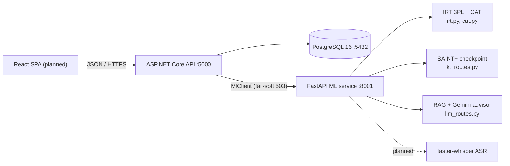

# Theory Section 3 Documentation Implementation Plan

> **For agentic workers:** REQUIRED SUB-SKILL: Use superpowers:subagent-driven-development (recommended) or superpowers:executing-plans to implement this plan task-by-task. Steps use checkbox (`- [ ]`) syntax for tracking.

**Goal:** Produce the Mảng-3 theory documentation (learning-path optimization problem + Greedy/DP/RL comparison + system architecture) and wire it into the project docs so a new reader can navigate everything.

**Architecture:** Documentation only — two new theory docs in `docs/`, a docs index, a real root README, surgical cross-links in the existing theory doc, and an SDD ledger entry. No code changes; the comparison experiment is *specified* here and *executed* later by task 15.

**Tech Stack:** Markdown (GitHub-flavored, mermaid diagrams), git.

**Spec:** `docs/superpowers/specs/2026-07-15-theory-section3-docs-design.md`

**Verified facts used throughout (do not re-derive):**
- Entities (`src/backend/LingoRoad/Data/AppDbContext.cs`): Users (unique Email), Skills (unique Code), SkillEdges (PK PrerequisiteId+SkillId), Items (index SkillId+CefrLevel; IRT fields A, B, C), TestSessions (Theta, ThetaSe, Status, ResultCefr), Responses (index SessionId; ThetaAfter, SeAfter, AnsweredAt), Masteries (PK UserId+SkillId), ReviewCards (index UserId+Due).
- .NET endpoints: `/auth/register`, `/auth/login`, `/skills`, `/skills/graph`, `/items`, `/admin/items/import`, `/placement/start`, `/placement/{sessionId}/answer`, `/placement/{sessionId}/result`, `/mastery`, `/path` (GET), `/path/advisor` (POST), `/reviews/cards`, `/reviews/due`, `/reviews/{cardId}/grade`.
- ML service (FastAPI): `/health`, `/cat/select`, `/kt/predict`, `/llm/advisor`.
- Ports/config: .NET API `http://localhost:5000` (launchSettings), ML `http://localhost:8001` (`MlService:BaseUrl`), Postgres 16 on 5432 (docker-compose, db/user/pass all `lingoroad`).
- Measured numbers (cite only these): CAT exact CEFR accuracy 0.750 at mean 18.5 items vs fixed-30 0.672 (`ml/reports/cat_simulation.md`); SAINT+ test AUC 0.7586 > DKT 0.7565 > DKVMN 0.7558 (`ml/reports/kt_results.md`); 617 items, 156 skills, 60k users / 7.5M interactions EdNet subset.

---

### Task 1: Write `docs/learning-path-optimization.md`

**Files:**
- Create: `docs/learning-path-optimization.md`

- [ ] **Step 1: Write the document**

Create `docs/learning-path-optimization.md` with exactly this content:

````markdown
# Learning Path Optimization in LingoRoad

Theory deliverable for **Mảng 3** (`src/backend/.claude/theory-reqquirement.md`), parts 1–2
of the required output: the formal optimization problem *(bài toán tối ưu)* with its
input/output/constraints, and the comparison of Greedy vs Dynamic Programming vs
Reinforcement Learning on accuracy and computational cost *(độ chính xác / chi phí tính
toán)*. The architecture part of the deliverable is in
[system-architecture.md](system-architecture.md). Paths are relative to the repo root.

## 1. The problem, informally

LingoRoad's curriculum is 156 micro-skills *(kỹ năng vi mô)* arranged in a prerequisite
DAG (nodes = skills with a CEFR level, edges = "must learn first"). Each learner has a
mastery vector — one number in [0, 1] per skill (`Masteries` table) — and a goal CEFR
level. A **learning path** *(lộ trình học)* is the sequence of study activities we
recommend. The requirement asks us to generate the path that **minimizes the time to
reach the goal** *(tối thiểu hóa thời gian đạt mục tiêu)*.

Four things make this more than "sort the skills":

1. **Precedence** — prerequisites must come first; this is a hard constraint, never a
   preference.
2. **Order-dependent gains** — studying a skill whose prerequisite is weak is mostly
   wasted effort, so the value of an action depends on what was studied before it.
3. **Forgetting** — mastery decays over time (`src/backend/LingoRoad/Domain/MasteryCalc.cs` decays
   toward 0.5 at 0.03/day), so a pure feed-forward order is not enough; good paths revisit.
4. **Stochasticity** — real learning gains vary per learner and per attempt.

Repo grounding: the production path builder is rule-based
(`src/backend/LingoRoad/Domain/PathBuilder.cs`, see
[ai-theory-and-algorithms.md](ai-theory-and-algorithms.md) §5); the mastery dynamics that
define our transition model are in `MasteryCalc.cs`; the planned RL proof-of-concept is
task 15 (`src/backend/.claude/tasks/task-15-dqn-poc.md`).

## 2. Formal problem statement *(input / output / constraints)*

### 2.1 Static combinatorial formulation *(bài toán tối ưu tổ hợp)*

**Input:**
- Skill graph G = (S, E): |S| = 156; edge (p, s) ∈ E means p is a prerequisite of s
  (`SkillEdges` table).
- CEFR level ℓ(s) ∈ {A1 … C2} and expected study cost c(s) > 0 (minutes) per skill.
- Current mastery m ∈ [0, 1]^S; mastery threshold τ = 0.8; mastered set
  D = {s : m_s ≥ τ}.
- Goal level g. Target set T = {s ∈ S : s is a leaf, ℓ(s) ≤ g} \ D.

**Output:** an ordering π = (s₁, …, s_k) of T — the learning path.

**Objective:** minimize total study time Σᵢ c(sᵢ), plus revisit costs when forgetting is
modeled.

**Constraints:**
- **C1 Precedence (hard):** for every (p, sᵢ) ∈ E with p ∉ D, p appears before sᵢ in π.
  (Assumes prerequisites of target skills are themselves studiable targets — leaves with
  ℓ(p) ≤ g. This is a modeling idealization: the seeded graph satisfies it for 140 of
  144 prerequisite edges; the exceptions — 3 container-as-prerequisite hierarchy edges
  and one B2 prerequisite of a B1 skill — are dropped by the production filters.)
- **C2 Goal filter:** every sᵢ has ℓ(sᵢ) ≤ g.
- **C3 Leaf-only:** container skills (nodes that are parents) are not studiable.
- **C4 Session budget:** the path is consumed in prefixes of at most B minutes per
  session.

**Hardness.** If gains are deterministic and order-independent, every topological order
costs the same and the problem is solvable in O(V+E) — this is why the production greedy
works at all. The problem becomes genuinely hard exactly when order affects cost:
single-machine sequencing under precedence constraints (1|prec|Σ wⱼCⱼ) is strongly
NP-hard (Lawler 1978; Lenstra & Rinnooy Kan 1978). Forgetting and stochastic gains push
the realistic problem out of the static frame entirely, which motivates:

### 2.2 Stochastic formulation — Markov Decision Process (MDP)

The canonical formulation, and the one task 15 implements at toy scale:

- **State** s_t = m_t ∈ [0, 1]^n — the mastery vector (optionally extended with time
  features).
- **Actions** A(s_t) — the studiable skills (leaf, ℓ ≤ g), optionally masked to skills
  whose prerequisites are met.
- **Transition:** studying skill a raises m_a by a learning gain — expected
  α·(1 − m_a) when a's prerequisites are met, a small wasted ε otherwise (toy values:
  α = 0.15, ε = 0.01) — while **all** skills decay from forgetting (toy: −0.005 per
  step; production: exponential decay toward 0.5 at 0.03/day per `MasteryCalc.cs`).
- **Reward** r_t = mean(m_{t+1}) − mean(m_t), plus a terminal bonus (+1) when every
  target skill reaches τ. (A pure min-time objective would use r = −1 per step; the
  mastery-gain form is a denser shaped proxy for the same goal.)
- **Objective:** a policy π maximizing E[Σ_t γᵗ r_t], discount γ = 0.98.
- **Bellman optimality equation:**
  Q*(s, a) = E[r + γ·max_{a'} Q*(s', a')], and V*(s) = max_a Q*(s, a).

The static formulation of §2.1 is the special case with deterministic gains, no
forgetting, and fixed per-skill costs.

## 3. Method 1 — Greedy *(thuật toán tham lam)*

Two greedy instantiations matter here:

**3.1 Rule pipeline (production, implemented).** `PathBuilder.cs`: Kahn topological sort
of the DAG with deterministic tie-breaking (CEFR then code), then filter — drop
containers (C3), drop above-goal (C2), drop mastered — annotate, truncate. Complexity
O(V+E). "Greedy" in the sense that it commits to one fixed priority order with zero
lookahead. Full rationale in [ai-theory-and-algorithms.md](ai-theory-and-algorithms.md) §5.

**3.2 Scoring greedy.** Repeatedly pick the unlocked skill with the best immediate value
per unit cost: score(a) = α·(1 − m_a) / c(a). O(n log n) with a heap. Note this is a
different policy from the fixed-order baseline in §7: it moves to a skill as soon as it
unlocks (prerequisite ≥ 0.5), not once the current skill is finished (≥ τ).

**Properties.**
- (+) Instant; zero training; zero data — works on day one with no learner history.
- (+) Constraints hold **by construction** (C1–C3 are filters, not penalties).
- (+) Fully explainable: "Past Simple precedes Present Perfect because it is its
  prerequisite."
- (−) Myopic: ignores *unlock value* (a low-gain prerequisite can unlock high-value
  dependents) and cannot time forgetting-aware revisits.
- (−) No optimality guarantee once order affects cost (§2.1 hardness).

## 4. Method 2 — Dynamic Programming *(quy hoạch động)*

DP solves the MDP **exactly** by backward induction on the Bellman equation.

**Value iteration:** V_{k+1}(s) = max_a E[r(s, a) + γ·V_k(s')]. The update is a
γ-contraction, so it converges to V* from any start. Per-sweep cost
O(|States| · |Actions| · |Successors|).

**The curse of dimensionality.** Mastery is continuous, so discretize each of n skills
into k levels → kⁿ states:
- n = 5, k = 11 → 11⁵ = 161,051 states — trivially tractable (the task-15 toy).
- n = 156, k = 11 → 11¹⁵⁶ ≈ 10¹⁶² states — more states than atoms in the observable
  universe (~10⁸⁰). DP can never run at production scale.

**Tractable special cases.**
- No forgetting + binary mastery: the state collapses to the *subset* of mastered
  skills → 2ⁿ states, a Held–Karp-style subset DP — usable to n ≈ 20.
- The toy environment (n = 5): value iteration on a k = 11 grid is cheap and yields the
  exact optimum of the **discretized** model — a near-optimal reference against which
  greedy and DQN are measured (§7).

DP also requires the transition model in closed form. With real learners we only ever
have *samples* of transitions — which is precisely the setting RL is built for.

## 5. Method 3 — Reinforcement Learning (DQN / PPO) *(học tăng cường)*

RL learns a policy from sampled interaction, escaping the curse of dimensionality with
function approximation (a neural network generalizes across states DP would enumerate).

**5.1 DQN** (Mnih et al. 2015) — what task 15 builds. Approximate Q*(s, ·) with an MLP
(toy: 5 → 64 → 64 → 5); ε-greedy exploration (1.0 → 0.05); experience replay (10k
buffer) to decorrelate samples; a target network synced every 200 steps to stabilize the
bootstrap target r + γ·max Q_target(s'); smooth-L1 loss, Adam 1e-3. Value-based and
off-policy (replays old experience), a good fit for a small discrete action space.

**5.2 PPO** (Schulman et al. 2017). Policy-gradient method optimizing the clipped
surrogate objective L = E[min(ρ_t·Â_t, clip(ρ_t, 1−ε, 1+ε)·Â_t)] where ρ_t is the
new/old policy probability ratio and Â_t the advantage estimate — the clip bounds each
update's policy shift, giving stable training. On-policy, so it needs more samples than
DQN, but it is preferred at larger scale: 156 actions instead of 5, native stochastic
policies (useful when several skills are equally good), and well-known robustness to
hyperparameters. PPO is the natural production-scale candidate; DQN is the right tool
for the 5-skill PoC.

**5.3 Hard constraints.** C1–C3 are not naturally expressed as rewards. The standard fix
is **action masking**: invalid actions get Q = −∞ (DQN) or probability 0 (PPO) before
selection. Reward penalties alone are soft — a trained policy can still occasionally
violate them, which is unacceptable for "never suggest a skill before its prerequisite".
(The toy env instead makes violations merely wasteful — gain ε — so the agent can
*discover* ordering; production must mask.)

**5.4 The simulator problem.** RL needs an environment to practice in, and real learners
are too slow and too valuable to explore on. So we train in a simulator — toy dynamics
now, an EdNet-fitted learner model later per the requirement — and inherit the
**sim-to-real gap**: the policy is only as good as the simulator is faithful
(`src/backend/.claude/requirement.md`, note V-5). This is the deepest reason production
keeps the greedy path while RL remains a proof-of-concept.

## 6. Comparison *(so sánh 3 phương pháp)*

"Accuracy" *(độ chính xác)* = closeness to the true optimum of the modeled problem.
"Computational cost" *(chi phí tính toán)* splits into **offline** (solve/train, once)
and **online** (per-request) cost.

| Criterion | Greedy (rules) | Dynamic Programming | RL (DQN/PPO) |
|---|---|---|---|
| Solution quality | No guarantee; near-optimal when gains are ~independent | **Exact optimum** of the modeled MDP | Approaches optimum with enough training; no guarantee |
| Online cost | O(V+E), sub-millisecond | O(1) table lookup — *if* the table exists | One NN forward pass, ~ms |
| Offline cost | None | O(kⁿ·\|A\|) per sweep — toy scale only | Simulator training (minutes on toy; hours+ at scale) |
| Data needs | None | Exact transition model in closed form | A simulator, or massive logged interactions |
| Hard constraints (C1–C3) | By construction | By state-space design | Require action masking |
| Explainability | Full | Full (within the model) | Low — Q-values are opaque |
| Scales to 156 skills | Yes | **No** (11¹⁵⁶ states) | Yes (function approximation) |
| Status in LingoRoad | **Production** (`PathBuilder.cs`) | Planned toy baseline (§7) | Planned PoC (task 15) |

Bottom line: greedy is the only method with zero cost, zero data needs, and full
explainability — and is optimal-enough while gains are near-independent. DP is the only
method with a guarantee, but it exists only at toy scale, where its job is to *measure
the others*. RL is the only method that both scales and optimizes long-horizon effects
(unlock value, forgetting), at the price of a simulator, training compute, and opacity.

## 7. Experiment protocol (executes with task 15)

Purpose: put measured numbers behind §6, all four policies on **identical dynamics**.
No code exists yet; this section is the specification task 15 executes.

**Environment.** `ToyLearnerEnv` from task 15: n = 5 chained skills (skill *i* needs
skill *i−1* ≥ 0.5), gain 0.15·(1−m) when unlocked else 0.01, decay 0.005/step for all
skills, episode ends when all ≥ 0.8 (+1 bonus) or after 60 steps. Note the transitions
are deterministic — only `reset()` is random — which makes an exact DP solution
well-defined.

**Policies.**
1. **Random** — uniform over the 5 actions.
2. **Greedy** — first skill with mastery < 0.8, front to back (task 15's fixed-order
   policy; the toy-scale analogue of §3.1's rule pipeline: a fixed priority order,
   skipping mastered skills).
3. **DP** — value iteration on the discretized env: k = 11 levels per skill
   (0.0, 0.1, …, 1.0) → 11⁵ = 161,051 states; transitions from the true dynamics with
   nearest-grid rounding; γ = 0.98; iterate until ‖V_{k+1} − V_k‖∞ < 1e-6; act greedily
   w.r.t. V on the rounded state.
4. **DQN** — as trained by task 15 (800 episodes, ε 1.0 → 0.05).

**Protocol.** Task 15's `run_policy` evaluation: 100 episodes, seed 123. Report per
policy: (a) mean return; (b) mean episode length (time-to-goal, censored at the 60-step
cap); (c) goal-reach rate within the cap; (d) offline cost — DP solve wall-clock, DQN
training wall-clock, zero for greedy/random; (e) per-decision latency.

**Expected ordering:** DP ≥ DQN ≥ greedy > random on return. DP is the expected upper
bound (exact for the discretized model); the gaps quantify how much optimality greedy
and DQN sacrifice — the "độ chính xác" column of §6, measured.

**Deliverable:** extra rows (DP) and columns (time-to-goal, goal-reach rate, offline
cost, latency) in `src/backend/ml/reports/dqn_poc.md`. Implementation note: the task-15
file predates the QuestGraph → LingoRoad rename; create code under
`src/backend/ml/lingoroad_ml/rl/`.

## 8. Recommendation *(đề xuất)*

A layered strategy — which is what the repo already does, now with its justification:

1. **Production: greedy rule pipeline.** Constraints guaranteed, fully explainable,
   works with zero interaction data — the cold-start reality of a new platform.
2. **Theory anchor: DP on the toy environment.** The (discretized-)exact optimum that
   makes the other two measurable.
3. **Research track: RL.** DQN PoC now (task 15). If the EdNet-fitted simulator
   materializes, PPO + action masking at 156 skills is the natural next step — deployed
   only behind an evaluation gate that shows it beating greedy in simulation.

Hybrid endgame: greedy computes the *feasible frontier* (the constraint layer), RL picks
*within* it (the optimization layer) — action masking makes this composition natural.

## References

- Bellman, R. (1957). *Dynamic Programming*. Princeton University Press.
- Sutton, R. & Barto, A. (2018). *Reinforcement Learning: An Introduction* (2nd ed.). MIT Press.
- Mnih, V. et al. (2015). Human-level control through deep reinforcement learning. *Nature* 518.
- Schulman, J. et al. (2017). Proximal Policy Optimization Algorithms. arXiv:1707.06347.
- Lawler, E. (1978). Sequencing jobs to minimize total weighted completion time subject to precedence constraints. *Annals of Discrete Mathematics* 2.
- Lenstra, J.K. & Rinnooy Kan, A.H.G. (1978). Complexity of scheduling under precedence constraints. *Operations Research* 26(1).
- Held, M. & Karp, R. (1962). A dynamic programming approach to sequencing problems. *SIAM Journal* 10(1).
````

- [ ] **Step 2: Verify every repo path referenced in the doc exists**

Run:
```bash
cd C:/Projects/LingoRoad
for p in src/backend/.claude/theory-reqquirement.md src/backend/LingoRoad/Domain/PathBuilder.cs src/backend/LingoRoad/Domain/MasteryCalc.cs src/backend/.claude/tasks/task-15-dqn-poc.md src/backend/.claude/requirement.md docs/ai-theory-and-algorithms.md docs/system-architecture.md; do [ -e "$p" ] && echo "OK  $p" || echo "MISS $p"; done
```
Expected: all `OK` except `docs/system-architecture.md` shows `MISS` (created in Task 2 — acceptable forward reference, re-check after Task 2).

- [ ] **Step 3: Commit**

```bash
git add docs/learning-path-optimization.md
git commit -m "docs: learning path optimization theory (problem spec, Greedy vs DP vs RL)

Co-Authored-By: Claude Fable 5 <noreply@anthropic.com>"
```

---

### Task 2: Write `docs/system-architecture.md`

**Files:**
- Create: `docs/system-architecture.md`

- [ ] **Step 1: Write the document**

Create `docs/system-architecture.md` with exactly this content:

````markdown
# LingoRoad System Architecture

Theory deliverable for **Mảng 3** (`src/backend/.claude/theory-reqquirement.md`), part 3
of the required output: the system architecture *(kiến trúc hệ thống)* integrating the AI
components from the other two theory areas. This documents the system **as built**, with
the React tier as a proposal. Paths are relative to the repo root.

## 1. Stack overview and rationale

Four parts:

| Tier | Technology | Status |
|---|---|---|
| Frontend | React SPA | Proposed (§6) — no code yet |
| Application backend | ASP.NET Core minimal API (.NET 10), `src/backend/LingoRoad/` | Built |
| AI backend | Python FastAPI + PyTorch/Gemini, `src/backend/ml/` | Built |
| Data | PostgreSQL 16 (EF Core migrations) | Built |

**How this fulfills the Mảng-3 technology requirement** *(Công nghệ nền tảng)*:

| Requirement names | Fulfilled by |
|---|---|
| Python ML libraries (PyTorch/TensorFlow) for the Mảng 1 & 2 models | `ml/` — IRT/CAT, SAINT+ (and DKT/DKVMN baselines) in PyTorch, RAG embeddings, planned Whisper |
| Python backend framework (FastAPI/Flask) | `ml/lingoroad_ml/serving/` — FastAPI is the **AI backend**, serving every model over HTTP |
| ReactJS frontend | Proposal in §6 |
| PostgreSQL schema optimized for model queries | §3 |

**The deliberate deviation.** The requirement's reading is one Python backend; LingoRoad
splits the backend in two. The application layer (auth, sessions, item bank, scheduling
state) is ASP.NET Core; Python/FastAPI owns everything AI. Rationale:

1. The relational domain benefits from strong typing and EF Core migrations; the ML
   domain *must* be Python (PyTorch, Gemini SDK, faster-whisper) — so a seam exists
   somewhere no matter what.
2. Putting the seam at an HTTP boundary (`Services/MlClient.cs` → FastAPI) isolates the
   GPU-heavy, dependency-heavy Python process: it can crash, restart, or be redeployed
   without taking down login or review scheduling.
3. The seam enforces a **fail-soft rule**: if the ML service is down, AI endpoints
   return `503 {"error":"ml_service_unavailable"}` while core features keep working.

Cost: two runtimes to operate. Accepted for the MVP; a pure-FastAPI application backend
remains a valid alternative reading of the requirement.

## 2. Components



The ML service is **stateless**: the .NET side owns all persistence and assembles any
context the models need (e.g., the learner's path and mastery for the advisor), so ML
instances can scale or restart freely.

## 3. PostgreSQL schema — designed for the models it feeds

Entities (`src/backend/LingoRoad/Data/AppDbContext.cs`):

| Table | Keys / indexes | Purpose | Model it feeds |
|---|---|---|---|
| Users | unique(Email) | auth, goal CEFR | path builder (goal filter) |
| Skills | unique(Code), CefrLevel, parent link | 174 skill nodes: 156 studiable leaves + 18 containers | path builder, mastery |
| SkillEdges | PK(PrerequisiteId, SkillId) | prerequisite DAG | topological sort |
| Items | index(SkillId, CefrLevel); IRT A, B, C | 617-item bank | CAT item selection |
| TestSessions | Theta, ThetaSe, Status, ResultCefr | placement state | CAT loop / EAP |
| Responses | index(SessionId); ThetaAfter, SeAfter, AnsweredAt | answer log | EAP re-estimation; KT sequences |
| Masteries | PK(UserId, SkillId) | mastery ∈ [0,1] | path filtering, mastery updates |
| ReviewCards | index(UserId, Due); FSRS S, D | spaced-repetition state | FSRS due queue |

**Query patterns the schema is tuned for** *(tối ưu cho truy vấn phục vụ mô hình)*:

- **CAT**: `Items(SkillId, CefrLevel)` filters the candidate pool per select call;
  `Responses(SessionId)` fetches the full response pattern for EAP re-estimation after
  every answer.
- **Knowledge tracing**: `Responses` ordered by `AnsweredAt` per user yields the
  (question, correctness, timing) sequence SAINT+ consumes at `/kt/predict`.
- **Path building**: `Masteries` PK(UserId, SkillId) makes "all mastery for this user"
  one index range read; `SkillEdges` composite PK covers DAG traversal without a join
  table scan.
- **Spaced repetition**: `ReviewCards(UserId, Due)` makes "what is due now" a pure index
  range scan — no sort, no filter.

## 4. Data flows — the five core loops

1. **Placement (adaptive test).** `POST /placement/start` → loop: .NET sends (θ, SE,
   administered items) to ML `POST /cat/select` → max-information item returned →
   learner answers `POST /placement/{sessionId}/answer` → EAP update persisted on
   `TestSessions`/`Responses` → stop rule (≥ 8 items, SE < 0.35, cap 30) →
   `GET /placement/{sessionId}/result` → CEFR level + initial `Masteries` seeded.
   (Simulation evidence: exact-CEFR accuracy 0.750 at a mean of 18.5 items vs 0.672 for
   a fixed 30-item form — `ml/reports/cat_simulation.md`.)
2. **Practice → mastery.** Each answer runs `MasteryCalc` (EMA 0.3 with 0.03/day decay
   toward 0.5) and upserts `Masteries`; optionally ML `POST /kt/predict` (SAINT+, test
   AUC 0.7586) estimates next-answer correctness. `GET /mastery` reads the vector.
3. **Path generation.** `GET /path?limit=N` → `PathBuilder` (topological sort + filters
   over Skills, SkillEdges, Masteries, user goal). Theory and alternatives:
   [learning-path-optimization.md](learning-path-optimization.md).
4. **Review scheduling.** `POST /reviews/cards` creates cards; `GET /reviews/due` reads
   the due queue; `POST /reviews/{cardId}/grade` runs the FSRS-4.5 update and writes the
   next `Due`.
5. **Study advisor (RAG).** `POST /path/advisor {question}` → .NET assembles path +
   mastery context → ML `POST /llm/advisor` → embed question (`gemini-embedding-001`),
   cosine top-3 over the corpus index (`QG_RAG_INDEX` .npz) → `gemini-2.5-flash` →
   Vietnamese answer. ML down → `503 ml_service_unavailable`.

## 5. Integration map — the five AI modules

Module numbering from `src/backend/.claude/requirement.md`. Theory-area ownership
*(mảng)* is **TBD** until the team finalizes the split; Mảng 3 owns the optimization
theory and this architecture regardless.

| Module | Endpoints | Components | Mảng |
|---|---|---|---|
| 1.1 Placement test | `/placement/*`, ML `/cat/select` | `irt.py`, `cat.py`, `PlacementEndpoints.cs` | TBD |
| 1.2 Knowledge tracing & learner model | `/mastery`, ML `/kt/predict` | `ml/lingoroad_ml/kt/`, `MasteryCalc.cs` | TBD |
| 1.3 Learning path | `/path`, `/path/advisor`, `/reviews/*` | `PathBuilder.cs`, `Fsrs.cs`, `ml/lingoroad_ml/llm/` | Mảng 3 (optimization); advisor TBD |
| 1.4 Exercise generation & AWE | planned (task 13) | planned | TBD |
| 1.5 Pronunciation & speaking | planned (task 14) | planned | TBD |

## 6. Frontend architecture (proposal)

No React code exists yet; this is the proposed structure.

- **Stack:** React 18 + TypeScript + Vite; React Router.
- **Server state:** TanStack Query, keyed by endpoint; answering an exercise or grading
  a review invalidates the `path`, `mastery`, and `reviews/due` queries so the UI tracks
  the model state without manual wiring. Client state (auth token, in-progress test) in
  a small context store.
- **API client:** generated from the .NET OpenAPI document, so endpoint changes surface
  as type errors.
- **Screens** (scope from `MVP_architecture.md`): auth, onboarding (goal + daily
  minutes), placement test player, dashboard (progress/streak/strong-weak skills),
  path view, exercise player, review queue, admin CMS.

## 7. Deployment & development environment

- **Database:** `docker compose up -d db` in `src/backend/` → postgres:16 on 5432
  (db/user/password all `lingoroad`).
- **Application API:** `dotnet run` in `src/backend/LingoRoad/` → `http://localhost:5000`.
- **ML service:** from `src/backend/ml/`:
  `.venv/Scripts/uvicorn lingoroad_ml.serving.app:app --port 8001`. The .NET side finds
  it via `MlService:BaseUrl` (default `http://localhost:8001`).
- **Environment variables:** `QG_KT_CHECKPOINT` (SAINT+ .pt), `QG_RAG_INDEX` (RAG .npz),
  `GEMINI_API_KEY` (advisor/embeddings).
- **GPU:** local RTX 4060 used for KT training and planned Whisper ASR; not required to
  run the core API.

## Related documents

- [ai-theory-and-algorithms.md](ai-theory-and-algorithms.md) — theory and evidence for
  every AI component this architecture serves.
- [learning-path-optimization.md](learning-path-optimization.md) — the optimization
  problem and method comparison behind module 1.3.
- `MVP_architecture.md` (repo root) — the original Vietnamese MVP design.
- `src/backend/.claude/requirement.md` — the five-module requirement.
````

- [ ] **Step 2: Verify referenced paths and endpoint names**

Run:
```bash
cd C:/Projects/LingoRoad
for p in src/backend/LingoRoad/Data/AppDbContext.cs src/backend/LingoRoad/Services/MlClient.cs src/backend/ml/lingoroad_ml/serving/app.py src/backend/ml/lingoroad_ml/kt src/backend/ml/lingoroad_ml/llm docs/learning-path-optimization.md MVP_architecture.md; do [ -e "$p" ] && echo "OK  $p" || echo "MISS $p"; done
```
Expected: all `OK`. Also re-run Task 1 Step 2's check — `docs/system-architecture.md` must now be `OK`.

- [ ] **Step 3: Commit**

```bash
git add docs/system-architecture.md
git commit -m "docs: system architecture (hybrid .NET + FastAPI + PostgreSQL)

Co-Authored-By: Claude Fable 5 <noreply@anthropic.com>"
```

---

### Task 3: Write `docs/README.md` (docs index)

**Files:**
- Create: `docs/README.md`

- [ ] **Step 1: Write the index**

Create `docs/README.md` with exactly this content:

````markdown
# LingoRoad Documentation

| Document | What it answers |
|---|---|
| [ai-theory-and-algorithms.md](ai-theory-and-algorithms.md) | Theory, implementation, and evidence for every AI component: IRT/CAT placement, knowledge tracing (SAINT+), mastery, FSRS spaced repetition, rule-based path, RAG advisor |
| [learning-path-optimization.md](learning-path-optimization.md) | The path-scheduling optimization problem (input/output/constraints); Greedy vs Dynamic Programming vs RL (DQN/PPO) on accuracy and computational cost; the task-15 experiment protocol |
| [system-architecture.md](system-architecture.md) | Full-stack architecture (React + ASP.NET Core + FastAPI + PostgreSQL), schema design for model queries, data flows, integration map of the five AI modules |
| `superpowers/` | Design specs and implementation plans produced during development |

## Mapping to the theory requirement

The practicum theory work is split into three areas *(mảng)*; the split of areas 1–2
among the team is still TBD.

| Area | Focus | Covered by |
|---|---|---|
| Mảng 1 & 2 (TBD split) | Assessment models (IRT/CAT, knowledge tracing) and NLP/LLM (exercise generation, AWE, advisor, speaking) | [ai-theory-and-algorithms.md](ai-theory-and-algorithms.md) §1–4, §6–8 |
| **Mảng 3** (`src/backend/.claude/theory-reqquirement.md`) | Learning-path optimization + technical infrastructure | [learning-path-optimization.md](learning-path-optimization.md) + [system-architecture.md](system-architecture.md) |
````

- [ ] **Step 2: Commit**

```bash
git add docs/README.md
git commit -m "docs: add documentation index

Co-Authored-By: Claude Fable 5 <noreply@anthropic.com>"
```

---

### Task 4: Rewrite root `README.md`

**Files:**
- Modify: `README.md` (currently a single line: `# LingoRoad`)

- [ ] **Step 1: Write the README**

Replace the full content of `README.md` with:

````markdown
# LingoRoad

AI-powered personalized English-learning platform for Vietnamese learners. LingoRoad
places a learner on the CEFR scale with an adaptive test, tracks what they know as they
practice, schedules reviews before they forget, and generates a personalized learning
path — with explanations in Vietnamese.

## AI features

| Feature | Technique | Status |
|---|---|---|
| Adaptive placement test | IRT 3PL + max-information CAT | Done |
| Knowledge tracing | SAINT+ Transformer (vs DKT/DKVMN baselines) | Done |
| Skill mastery | EMA with forgetting decay | Done |
| Spaced repetition | FSRS-4.5 | Done |
| Personalized learning path | Prerequisite-DAG rules; DQN PoC planned | Done / planned |
| Vietnamese study advisor | RAG + Gemini | Done (code) |
| Exercise generation, AWE, speaking | LLM + Whisper ASR | Planned |

Details and evidence: [docs/ai-theory-and-algorithms.md](docs/ai-theory-and-algorithms.md).

## Repository layout

```
docs/                       Project documentation (start at docs/README.md)
src/backend/LingoRoad/      ASP.NET Core application API (.NET 10)
src/backend/LingoRoad.Tests/  .NET test suite
src/backend/ml/             Python ML: training, research, FastAPI model serving
src/backend/docker-compose.yml  PostgreSQL 16
DESIGN.md, MVP_architecture.md, LingoRoad.md   Original (Vietnamese) design documents
```

## Quick start

```bash
# 1. Database
cd src/backend && docker compose up -d db

# 2. Application API  → http://localhost:5000
cd src/backend/LingoRoad && dotnet run

# 3. ML service       → http://localhost:8001
cd src/backend/ml && .venv/Scripts/uvicorn lingoroad_ml.serving.app:app --port 8001
```

Tests: `dotnet test src/backend` and `cd src/backend/ml && .venv/Scripts/python -m pytest tests/ -v`.

Architecture, schema, and data flows: [docs/system-architecture.md](docs/system-architecture.md).
````

- [ ] **Step 2: Commit**

```bash
git add README.md
git commit -m "docs: real project README (overview, layout, quick start)

Co-Authored-By: Claude Fable 5 <noreply@anthropic.com>"
```

---

### Task 5: Cross-links in `docs/ai-theory-and-algorithms.md`

**Files:**
- Modify: `docs/ai-theory-and-algorithms.md` (3 surgical edits, no content rewrites)

- [ ] **Step 1: Add deep-dive pointer under the header table**

Edit — old string:
```
| Path optimization | DQN proof-of-concept | task 15 | Planned |

---
```
New string:
```
| Path optimization | DQN proof-of-concept | task 15 | Planned |

Deep-dives: [learning-path-optimization.md](learning-path-optimization.md) (formal
problem statement, Greedy vs DP vs RL) and [system-architecture.md](system-architecture.md)
(full-stack architecture and schema).

---
```

- [ ] **Step 2: Add cross-link at the end of §5**

Edit — old string:
```
(never suggest a skill before its prerequisite), the result must be explainable to the
learner, and there is no interaction data yet to fit a policy — the DQN task (§8) is the
planned learned alternative.
```
New string:
```
(never suggest a skill before its prerequisite), the result must be explainable to the
learner, and there is no interaction data yet to fit a policy — the DQN task (§8) is the
planned learned alternative. The formal optimization problem and the three-method
comparison are developed in [learning-path-optimization.md](learning-path-optimization.md).
```

- [ ] **Step 3: Add cross-link at the end of §8**

Edit — old string:
```
It is a PoC only: real learner data is far too scarce to train RL safely, which is exactly
why production uses §5's rules.
```
New string:
```
It is a PoC only: real learner data is far too scarce to train RL safely, which is exactly
why production uses §5's rules. The experiment protocol comparing DQN with DP and greedy
baselines on the same environment is specified in
[learning-path-optimization.md](learning-path-optimization.md) §7.
```

- [ ] **Step 4: Commit**

```bash
git add docs/ai-theory-and-algorithms.md
git commit -m "docs: cross-link theory doc to optimization and architecture docs

Co-Authored-By: Claude Fable 5 <noreply@anthropic.com>"
```

---

### Task 6: SDD progress-ledger entry

**Files:**
- Modify: `src/backend/.superpowers/sdd/progress.md` (prepend a session section — newest first)

- [ ] **Step 1: Prepend the session entry**

Edit — old string:
```
# SDD progress ledger — LingoRoad plan

## Session 2026-07-13 later (task 12 code complete, step 5 BLOCKED; resume here)
```
New string:
```
# SDD progress ledger — LingoRoad plan

## Session 2026-07-15 (theory Mảng-3 docs)
- User owns theory Mảng 3 = the whole of src/backend/.claude/theory-reqquirement.md
  (optimization + infrastructure). Brainstormed via superpowers; spec committed 10e74a2
  (docs/superpowers/specs/2026-07-15-theory-section3-docs-design.md).
- Written: docs/learning-path-optimization.md (problem spec, Greedy vs DP vs RL,
  task-15 experiment protocol), docs/system-architecture.md (hybrid .NET+FastAPI+Postgres
  documented as-is per user choice), docs/README.md index, root README.md rewrite,
  cross-links in docs/ai-theory-and-algorithms.md.
- Decisions: EN docs with VN key terms (user translates for report); Mảng 1/2 split TBD
  (integration written against the 5 modules); theory now, measured numbers when task 15
  runs.
- Task 15 gains a comparison duty: DP value-iteration (k=11 grid) + greedy + random vs
  DQN on ToyLearnerEnv; protocol in learning-path-optimization.md §7; code goes under
  ml/lingoroad_ml/rl/ (task file predates rename).
- Task-1 doc revised after quality review (table pipe escape, src/backend/ path
  prefixes, greedy-equivalence correction, discretized-DP hedging, goal-reach-rate
  metric); plan updated in lockstep.
- Gemini credit blocker from 2026-07-13 still stands (unrelated to this docs work).

## Session 2026-07-13 later (task 12 code complete, step 5 BLOCKED; resume here)
```

- [ ] **Step 2: Commit**

```bash
git add src/backend/.superpowers/sdd/progress.md
git commit -m "docs(sdd): record theory section 3 documentation session

Co-Authored-By: Claude Fable 5 <noreply@anthropic.com>"
```

---

### Task 7: Final verification

- [ ] **Step 1: All internal doc links resolve**

Run:
```bash
cd C:/Projects/LingoRoad
grep -rhoE '\]\(([a-zA-Z0-9_./-]+\.md)\)' docs/*.md README.md | sed 's/](\(.*\))/\1/' | sort -u
```
For each printed relative path, confirm the file exists relative to the doc that
references it (docs/*.md links are relative to `docs/`; README.md links are relative to
repo root). Expected: no missing targets.

- [ ] **Step 2: No invented numbers**

Run:
```bash
grep -nE '0\.[0-9]{2,4}|[0-9]+ items|AUC' docs/learning-path-optimization.md docs/system-architecture.md
```
Expected: every measured figure is one of: 0.750, 18.5, 0.672, 0.7586, 617, 156 (all from
`ml/reports/` or the seeded DB). Constants like 0.8 (τ), 0.98 (γ), 0.15/0.01/0.005
(toy dynamics), 0.03 (decay), 0.35 (SE stop), 0.5 (prereq gate) are model parameters,
not measurements — those are fine.

- [ ] **Step 2b: Table shape check**

Every markdown table row in `docs/learning-path-optimization.md` and
`docs/system-architecture.md` must have the same number of unescaped `|` delimiters as
its table's header row (escaped `\|` doesn't count). Check with a short python script or
by rendering. Expected: no malformed rows.

- [ ] **Step 3: Working tree clean, log sensible**

Run: `git status --short && git log --oneline -8`
Expected: clean tree; 6 new `docs:`/`docs(sdd):` commits on top of `10e74a2`.
