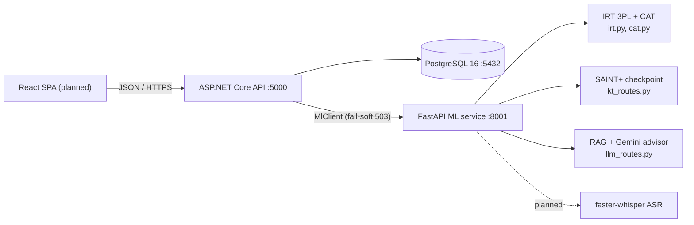

# LingoRoad System Architecture

Theory deliverable for **Mảng 3** (`src/backend/.claude/theory-reqquirement.md`), part 3
of the required output: the system architecture *(kiến trúc hệ thống)* integrating the AI
components from the other two theory areas. This documents the system **as built**, with
the React tier as a proposal. Paths are relative to the repo root.

## 1. Stack overview and rationale

Four parts:

| Tier | Technology | Status |
|---|---|---|
| Frontend | React SPA | Proposed (§6) — no code yet |
| Application backend | ASP.NET Core minimal API (.NET 10), `src/backend/LingoRoad/` | Built |
| AI backend | Python FastAPI + PyTorch/Gemini, `src/backend/ml/` | Built |
| Data | PostgreSQL 16 (EF Core migrations) | Built |

**How this fulfills the Mảng-3 technology requirement** *(Công nghệ nền tảng)*:

| Requirement names | Fulfilled by |
|---|---|
| Python ML libraries (PyTorch/TensorFlow) for the Mảng 1 & 2 models | `ml/` — IRT/CAT, SAINT+ (and DKT/DKVMN baselines) in PyTorch, RAG embeddings, planned Whisper |
| Python backend framework (FastAPI/Flask) | `ml/lingoroad_ml/serving/` — FastAPI is the **AI backend**, serving every model over HTTP |
| ReactJS frontend | Proposal in §6 |
| PostgreSQL schema optimized for model queries | §3 |

**The deliberate deviation.** The requirement's reading is one Python backend; LingoRoad
splits the backend in two. The application layer (auth, sessions, item bank, scheduling
state) is ASP.NET Core; Python/FastAPI owns everything AI. Rationale:

1. The relational domain benefits from strong typing and EF Core migrations; the ML
   domain *must* be Python (PyTorch, Gemini SDK, faster-whisper) — so a seam exists
   somewhere no matter what.
2. Putting the seam at an HTTP boundary (`Services/MlClient.cs` → FastAPI) isolates the
   GPU-heavy, dependency-heavy Python process: it can crash, restart, or be redeployed
   without taking down login or review scheduling.
3. The seam enforces a **fail-soft rule**: if the ML service is down, AI endpoints
   return `503 {"error":"ml_service_unavailable"}` while core features keep working.

Cost: two runtimes to operate. Accepted for the MVP; a pure-FastAPI application backend
remains a valid alternative reading of the requirement.

## 2. Components

The ML service is **stateless**: the .NET side owns all persistence and assembles any
context the models need (e.g., the learner's path and mastery for the advisor), so ML
instances can scale or restart freely.

## 3. PostgreSQL schema — designed for the models it feeds

Entities (`src/backend/LingoRoad/Data/AppDbContext.cs`):

| Table | Keys / indexes | Purpose | Model it feeds |
|---|---|---|---|
| Users | unique(Email) | auth, goal CEFR | path builder (goal filter) |
| Skills | unique(Code), CefrLevel, parent link | 174 skill nodes: 156 studiable leaves + 18 containers | path builder, mastery |
| SkillEdges | PK(PrerequisiteId, SkillId) | prerequisite DAG | topological sort |
| Items | index(SkillId, CefrLevel); IRT A, B, C | 617-item bank | CAT item selection |
| TestSessions | Theta, ThetaSe, Status, ResultCefr | placement state | CAT loop / EAP |
| Responses | index(SessionId); ThetaAfter, SeAfter, AnsweredAt | answer log | EAP re-estimation; KT sequences |
| Masteries | PK(UserId, SkillId) | mastery ∈ [0,1] | path filtering, mastery updates |
| ReviewCards | index(UserId, Due); FSRS S, D | spaced-repetition state | FSRS due queue |

**Query patterns the schema is tuned for** *(tối ưu cho truy vấn phục vụ mô hình)*:

- **CAT**: `Items(SkillId, CefrLevel)` filters the candidate pool per select call;
  `Responses(SessionId)` fetches the full response pattern for EAP re-estimation after
  every answer.
- **Knowledge tracing**: `Responses` ordered by `AnsweredAt` per user yields the
  (question, correctness, timing) sequence SAINT+ consumes at `/kt/predict`.
- **Path building**: `Masteries` PK(UserId, SkillId) makes "all mastery for this user"
  one index range read; `SkillEdges` composite PK covers DAG traversal without a join
  table scan.
- **Spaced repetition**: `ReviewCards(UserId, Due)` makes "what is due now" a pure index
  range scan — no sort, no filter.

## 4. Data flows — the five core loops

1. **Placement (adaptive test).** `POST /placement/start` → loop: .NET sends (θ, SE,
   administered items) to ML `POST /cat/select` → max-information item returned →
   learner answers `POST /placement/{sessionId}/answer` → EAP update persisted on
   `TestSessions`/`Responses` → stop rule (≥ 8 items, SE < 0.35, cap 30) →
   `GET /placement/{sessionId}/result` → CEFR level + initial `Masteries` seeded.
   (Simulation evidence: exact-CEFR accuracy 0.750 at a mean of 18.5 items vs 0.672 for
   a fixed 30-item form — `ml/reports/cat_simulation.md`.)
2. **Practice → mastery.** Each answer runs `MasteryCalc` (EMA 0.3 with 0.03/day decay
   toward 0.5) and upserts `Masteries`; optionally ML `POST /kt/predict` (SAINT+, test
   AUC 0.7586) estimates next-answer correctness. `GET /mastery` reads the vector.
3. **Path generation.** `GET /path?limit=N` → `PathBuilder` (topological sort + filters
   over Skills, SkillEdges, Masteries, user goal). Theory and alternatives:
   [learning-path-optimization.md](learning-path-optimization.md).
4. **Review scheduling.** `POST /reviews/cards` creates cards; `GET /reviews/due` reads
   the due queue; `POST /reviews/{cardId}/grade` runs the FSRS-4.5 update and writes the
   next `Due`.
5. **Study advisor (RAG).** `POST /path/advisor {question}` → .NET assembles path +
   mastery context → ML `POST /llm/advisor` → embed question (`gemini-embedding-001`),
   cosine top-3 over the corpus index (`QG_RAG_INDEX` .npz) → `gemini-2.5-flash` →
   Vietnamese answer. ML down → `503 ml_service_unavailable`.

## 5. Integration map — the five AI modules

Module numbering from `src/backend/.claude/requirement.md`. Theory-area ownership
*(mảng)* is **TBD** until the team finalizes the split; Mảng 3 owns the optimization
theory and this architecture regardless.

| Module | Endpoints | Components | Mảng |
|---|---|---|---|
| 1.1 Placement test | `/placement/*`, ML `/cat/select` | `irt.py`, `cat.py`, `PlacementEndpoints.cs` | TBD |
| 1.2 Knowledge tracing & learner model | `/mastery`, ML `/kt/predict` | `ml/lingoroad_ml/kt/`, `MasteryCalc.cs` | TBD |
| 1.3 Learning path | `/path`, `/path/advisor`, `/reviews/*` | `PathBuilder.cs`, `Fsrs.cs`, `ml/lingoroad_ml/llm/` | Mảng 3 (optimization); advisor TBD |
| 1.4 Exercise generation & AWE | planned (task 13) | planned | TBD |
| 1.5 Pronunciation & speaking | planned (task 14) | planned | TBD |

## 6. Frontend architecture (proposal)

No React code exists yet; this is the proposed structure.

- **Stack:** React 18 + TypeScript + Vite; React Router.
- **Server state:** TanStack Query, keyed by endpoint; answering an exercise or grading
  a review invalidates the `path`, `mastery`, and `reviews/due` queries so the UI tracks
  the model state without manual wiring. Client state (auth token, in-progress test) in
  a small context store.
- **API client:** generated from the .NET OpenAPI document, so endpoint changes surface
  as type errors.
- **Screens** (scope from `MVP_architecture.md`): auth, onboarding (goal + daily
  minutes), placement test player, dashboard (progress/streak/strong-weak skills),
  path view, exercise player, review queue, admin CMS.

## 7. Deployment & development environment

- **Database:** `docker compose up -d db` in `src/backend/` → postgres:16 on 5432
  (db/user/password all `lingoroad`).
- **Application API:** `dotnet run` in `src/backend/LingoRoad/` → `http://localhost:5000`.
- **ML service:** from `src/backend/ml/`:
  `.venv/Scripts/uvicorn lingoroad_ml.serving.app:app --port 8001`. The .NET side finds
  it via `MlService:BaseUrl` (default `http://localhost:8001`).
- **Environment variables:** `QG_KT_CHECKPOINT` (SAINT+ .pt), `QG_RAG_INDEX` (RAG .npz),
  `GEMINI_API_KEY` (advisor/embeddings).
- **GPU:** local RTX 4060 used for KT training and planned Whisper ASR; not required to
  run the core API.

## Related documents

- [ai-theory-and-algorithms.md](ai-theory-and-algorithms.md) — theory and evidence for
  every AI component this architecture serves.
- [learning-path-optimization.md](learning-path-optimization.md) — the optimization
  problem and method comparison behind module 1.3.
- `MVP_architecture.md` (repo root) — the original Vietnamese MVP design.
- `src/backend/.claude/requirement.md` — the five-module requirement.
